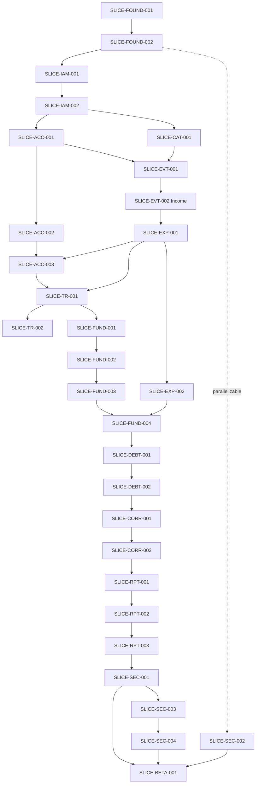

# Annotasi Finance — MVP Implementation Plan

## 1. Document Status

| Field | Value |
|---|---|
| Session | Session 24 — MVP Implementation Plan |
| Workflow stage | Implementation Planning |
| Status | Candidate implementation plan pending review |
| Product Definition | Complete |
| Domain Modeling | Complete |
| Architecture Baseline | Complete |
| Implementation | Not started |
| Repository | Documentation-only and greenfield, confirmed by direct inspection (Section 5) |

This is the final planning session before implementation begins. Implementation MAY begin only after this document is reviewed, accepted, committed, and pushed by the user. Until then it is a candidate plan. Nothing in this document authorizes code, framework initialization, or any commit.

## 2. Purpose

This document resolves the bounded Implementation-Time Selections named by `docs/architecture/ARCHITECTURE_BASELINE.md` and translates the approved product, domain, and Architecture constraints into ordered, review-sized implementation milestones and vertical slices. It selects exact technology versions and providers using current official primary sources, defines operational budgets, dependency sequencing, risk-driven ordering, quality gates, and readiness/done criteria, and identifies exactly one first coding slice.

It does not write application code, initialize a framework, create a package manifest, create a source directory, create a migration, define a table-by-table schema, define a detailed endpoint contract, create a GitHub issue, create an implementation ticket in an external system, or estimate personal productivity in hours.

## 3. Source Authority

Authority order for this document:

1. `docs/domain/EXECUTABLE_DOMAIN_SPECIFICATION.md` — normative domain behavior, invariants, examples, properties.
2. `docs/architecture/ARCHITECTURE_BASELINE.md` — adopted technical baseline, decisions, constraints, risks.
3. `docs/product/ANNOTASI_FINANCE_MVP_PRD.md` — Private Beta v1 requirements baseline.
4. `docs/product/PRODUCT_IDENTITY.md` — approved product direction.
5. `CLAUDE.md` — repository workflow and operating constraints.
6. `docs/domain/DOMAIN_DECISION_REGISTER.md` — decision resolutions, referenced where a specific DEC-ID needs full reasoning.
7. `docs/domain/AGGREGATE_CANDIDATES.md` — candidate responsibility and consistency-boundary analysis, referenced where module ownership needs full reasoning.
8. `docs/project/PROJECT_STATE.md` — navigation only; never sole authority for a product, domain, or Architecture fact.
9. Current official technology/provider sources — may verify technical facts (versions, capabilities, regions, pricing) but MAY NOT override product, domain, or Architecture meaning.
10. This Session 24 instruction — governs process and document shape only.

When a current provider or framework limitation conflicts with the Architecture baseline, this plan does not silently change the Architecture. It identifies the conflict, evaluates a compatible alternative within the adopted Architecture category, and — if no compatible candidate exists — stops and reports rather than weakening the constraint. No such conflict was found during this session's research (Section 6).

`PROJECT_STATE.md` is navigation only and is not cited as sole authority anywhere in this document.

## 4. Planning Method

For every bounded selection named by the Architecture Baseline, this plan:

1. identifies the Architecture category and the constraint it must preserve;
2. gathers current official primary-source evidence (Section 6);
3. evaluates at least two realistic candidates where multiple providers exist (Section 7 method, applied in Sections 8–10);
4. selects one candidate baseline and, where practical, one fallback;
5. records the selection using the fixed vocabulary in Section 7;
6. states the exact reconsideration trigger.

For sequencing, this plan:

1. maps all 55 Behavior IDs, 26 invariants, 37 acceptance examples, 32 properties, 66 Architecture decisions, and 21 Architecture risks onto milestones and slices (Sections 30, 33, 34, 36, 44);
2. orders milestones so that isolation, exact-money, chronology, and transactional foundations are proven before any user-facing financial behavior is built (Section 33);
3. keeps every slice independently reviewable and revertible (Section 34);
4. defines Definition of Ready and Definition of Done once, applied uniformly (Sections 38–39);
5. names exactly one first coding slice (Section 40).

No product, domain, or Architecture rule is weakened, narrowed, or silently reinterpreted anywhere in this method.

## 5. Repository Starting State

Directly inspected this session (`find . -maxdepth 3`):

- Files: `CLAUDE.md`, `README.md`, `docs/architecture/ARCHITECTURE_BASELINE.md`, seven `docs/domain/*.md` artifacts, `docs/product/ANNOTASI_FINANCE_MVP_PRD.md`, `docs/product/PRODUCT_IDENTITY.md`, `docs/project/PROJECT_STATE.md`, `skills-lock.json`.
- Directories: `.agents/skills/*`, `.claude/skills`, `docs/architecture`, `docs/domain`, `docs/product`, `docs/project`.
- Absent: `package.json`, `pnpm-workspace.yaml`, any lockfile, any `tsconfig*.json`, `apps/`, `packages/`, `database/`, `infra/`, `scripts/`, Docker/Compose files, CI workflow files, environment example files, `docs/implementation/` (created by this session solely to hold this file).

**Conclusion:** the repository is documentation-only and greenfield, exactly as the Architecture Baseline states (§5). No legacy runtime, framework, schema, or integration constrains any selection below.

## 6. Current-Source Research Register

Retrieved 2026-08-01. Format: Fact | Source Title | Publisher | URL.

| # | Verified Fact | Source Title | Publisher | URL |
|---|---|---|---|---|
| 1 | Node.js 24 is Active LTS; Node.js 22 is Maintenance LTS; Node.js 26 is Current and enters LTS October 2026 | Node.js — Evolving the Node.js Release Schedule | OpenJS Foundation (Node.js) | https://nodejs.org/en/blog/announcements/evolving-the-nodejs-release-schedule |
| 2 | TypeScript 6.0 and TypeScript 7.0 were officially announced by Microsoft; TypeScript 7.0 is officially released. The npm registry lists 7.0.2 as a published version (observed Aug 2026). TypeScript 6.x remains the initial implementation baseline because compatibility with NestJS tooling, `typescript-eslint`, Drizzle Kit, and compiler-API-dependent tooling must be verified before TypeScript 7.x is adopted | Announcing TypeScript 6.0 / Announcing TypeScript 7.0 / typescript (npm package registry) | Microsoft DevBlogs / npm, Inc. (package maintainer registry) | https://devblogs.microsoft.com/typescript/announcing-typescript-6-0/ ; https://devblogs.microsoft.com/typescript/announcing-typescript-7-0/ ; https://www.npmjs.com/package/typescript |
| 3a | pnpm 11.12 in use July 2026 | pnpm — npm | npm, Inc. (package maintainer registry) | https://www.npmjs.com/package/pnpm |
| 3b | Turborepo latest 2.10.7; Turborepo 2.x tasks field stable with next breaking change 18+ months out | turbo — npm | npm, Inc. (package maintainer registry) | https://www.npmjs.com/package/turbo |
| 4 | Next.js latest stable 16.2.12 (July 25, 2026); Next.js 16 requires Node.js 20+ and supports React 19 | Next.js Support Policy / Next.js blog | Vercel (Next.js) | https://nextjs.org/support-policy |
| 5 | `@nestjs/platform-fastify` latest 11.1.28 (observed Aug 1, 2026); NestJS 11 supports Express v5 and Fastify adapters | @nestjs/platform-fastify — npm | npm, Inc. (package maintainer registry) | https://www.npmjs.com/package/@nestjs/platform-fastify |
| 6 | CVE-2026-2293 (Fastify URL Encoding Middleware Bypass, TOCTOU): NestJS + `@nestjs/platform-fastify` middleware/route path-normalization mismatch allowed authentication-middleware bypass; patched in 11.1.14 | GHSA-8wpr-639p-ccrj — Fastify URL Encoding Middleware Bypass (TOCTOU) | GitHub Security Advisory Database (nestjs/nest) | https://github.com/nestjs/nest/security/advisories/GHSA-8wpr-639p-ccrj |
| 7 | CVE-2026-54281: a related, more complete fix to the same class of Fastify path-normalization/middleware-bypass issue in `@nestjs/platform-fastify`, patched in 11.1.24 | nestjs/nest Security Advisories | GitHub Security Advisory Database / NVD | https://github.com/nestjs/nest/security/advisories ; https://nvd.nist.gov/vuln/detail/CVE-2026-54281 |
| 8 | `drizzle-orm` latest 0.45.2; `drizzle-kit generate`/`migrate` cover SQL migration generation and application; Drizzle supports PostgreSQL including Neon, Supabase, and other managed providers | Drizzle ORM — Migrations / drizzle-orm — npm | Drizzle Team | https://orm.drizzle.team/docs/migrations ; https://www.npmjs.com/package/drizzle-orm |
| 9 | Zod latest stable 4.4.3 (observed Aug 2026); ~240M weekly downloads | zod — npm | npm, Inc. (package maintainer registry) | https://www.npmjs.com/package/zod |
| 10 | PostgreSQL supports each major version for 5 years after initial release; after that anniversary a major version receives one final minor release and reaches end-of-life; as of July 2026 versions 18, 17, 16, 15, 14 receive security updates | Versioning Policy | PostgreSQL Global Development Group | https://www.postgresql.org/support/versioning/ |
| 11 | `@fast-check/vitest` 0.4.1 integrates fast-check property-based testing into Vitest; fast-check has 10M+ weekly downloads and native TypeScript/Vitest/Jest/node:test support | @fast-check/vitest — npm | npm, Inc. (package maintainer registry) | https://www.npmjs.com/package/@fast-check/vitest |
| 12 | `@testcontainers/postgresql` latest 12.0.4 (observed Aug 1, 2026), providing real disposable PostgreSQL containers for Node.js integration tests | Testcontainers PostgreSQL Module | Testcontainers (testcontainers.com) | https://testcontainers.com/modules/postgresql/ |
| 13 | Playwright latest 1.61.1 (observed Aug 1, 2026); supports Chromium/Firefox/WebKit, `getByRole`/accessibility-tree-based selectors; official guidance points to axe-core (`@axe-core/playwright`) for WCAG 2.0/2.1/2.2 rule checking | Playwright release notes | Microsoft (Playwright) | https://playwright.dev/docs/release-notes |
| 14 | Clerk Free plan: up to 50,000 Monthly Retained Users (MRU) — a user counts as retained only if they return at least 24 hours after signup; not "MAU" | Pricing | Clerk | https://clerk.com/pricing |
| 15 | Clerk Pro: $20/mo billed annually or $25/mo billed monthly; includes 50K MRU plus 1 Enterprise connection; overage above 50K MRU starts at $0.02/MRU/mo with volume discounts at higher tiers | Pricing / Updated Pricing changelog | Clerk | https://clerk.com/pricing ; https://clerk.com/changelog/2026-02-05-new-plans-more-value |
| 16 | Auth0 Free plan: up to 25,000 Monthly Active Users (MAU); B2C Essentials paid plan starts at $35/mo for 500 MAU | Pricing | Auth0 (Okta) | https://auth0.com/pricing |
| 17 | Supabase Pro plan includes daily backups only. Point-in-Time Recovery (PITR) is a separate paid add-on, billed hourly at $100/month per 7 days of retention, and requires at least a Small compute add-on. Southeast Asia (Singapore) region (`ap-southeast-1`) is available under the APAC region list | Database Backups / Manage Point-in-Time Recovery usage / Available regions | Supabase | https://supabase.com/docs/guides/platform/backups ; https://supabase.com/docs/guides/platform/manage-your-usage/point-in-time-recovery ; https://supabase.com/docs/guides/platform/regions |
| 18 | Neon supports PostgreSQL 14, 15, 16, 17, and 18; enforces PostgreSQL Row-Level Security and validates JWTs from any auth provider; uses PgBouncer for connection pooling up to 10,000 concurrent connections; PITR history: Free plan up to 6 hours (capped at 1GB of changes) at no charge, Launch plan up to 7 days at $0.20/GB-month, Scale plan up to 30 days at $0.20/GB-month; Launch-plan compute billed at $0.106/CU-hour and storage at $0.35/GB-month, purely usage-based with no minimum spend; Asia Pacific (Singapore) region available as `aws-ap-southeast-1` | Postgres compatibility / Connection pooling / Managed Postgres providers PITR FAQ / Regions / Pricing | Neon | https://neon.com/docs/reference/compatibility ; https://neon.com/docs/connect/connection-pooling ; https://neon.com/faqs/managed-postgres-providers-point-in-time-recovery ; https://neon.com/docs/introduction/regions ; https://neon.com/pricing |
| 19 | Vercel publishes explicit Singapore (`sin1`) regional pricing for Managed Infrastructure on the Pro plan; Pro starts at $20/mo platform fee + metered usage | Singapore (sin1) pricing | Vercel | https://vercel.com/docs/pricing/regional-pricing/sin1 |
| 20 | Fly.io confirms a Singapore region (`sin`) with WireGuard private-network gateway support, alongside 17 other regions | Regions · Fly Docs | Fly.io | https://fly.io/docs/reference/regions/ |
| 21 | Sentry Developer plan is free forever (5,000 errors/month, 1 user); Team plan from $26/mo billed annually (50K errors, 5GB logs, 5GB application metrics, 50 replays, 1 cron/uptime monitor, 1GB attachments); official Next.js and Node.js SDKs | Pricing: Free Developer Plan, Pay as You Grow | Sentry | https://sentry.io/pricing/ |
| 22 | GitHub Free includes private repositories with 2,000 GitHub Actions minutes/month on GitHub-hosted runners plus 10GB Actions cache storage per repository; Actions usage on GitHub-hosted runners is unlimited on public repositories | Billing and usage — GitHub Actions | GitHub | https://docs.github.com/en/actions/concepts/billing-and-usage |

Every version/provider selection in Sections 8–10 cites one or more rows above by number, and every coding-blocking technology or provider fact now cites an official primary source (the project's own site/docs, the package's own npm page, the official standards body, or the official security-advisory database) rather than a third-party blog, comparison site, or aggregator. No blog post, unsourced comparison site, or remembered figure is used as the sole authority for a coding-blocking selection.

## 7. Implementation Selection Vocabulary

- **Selected for Initial Implementation** — fixed for the first implementation slices touching this area; changing it later requires an explicit Architecture-consistent review.
- **Selected with Pre-Implementation Verification** — the category and baseline are fixed; an exact pin, quota, or capability must be re-confirmed against the official source immediately before the touching slice starts (e.g., re-run a version/compatibility check).
- **Conditional Selection** — one of two or more named outcomes is chosen based on an explicit, stated condition (e.g., export delivery mode depends on the first-wave scope decision in Section 12).
- **Deferred Until Pre-Beta** — the category is intentionally not resolved now; it must be resolved before the first beta invitation (Section 43 gate), never silently at code time.
- **Not Selected for v1** — evaluated and rejected for the Private Beta v1 implementation window.

All selections below remain pending user review, commit, and push.

## 8. Resolved Implementation-Time Selections

| Selection ID | Topic | Status | Selected Baseline | Fallback | Official Evidence | Architecture Decisions Preserved | Cost/Plan Constraint | Pre-Implementation Verification | Reconsideration Trigger |
|---|---|---|---|---|---|---|---|---|---|
| SEL-VER-01 | Exact runtime/tool version pins | Selected with Pre-Implementation Verification | See Section 9 table | N/A | Register rows 1–13 | ARCH-IMPL-01 | None beyond normal tooling | Re-run each verification command in Section 9 immediately before Slice SLICE-FOUND-001 | Any listed tool publishes a breaking release before Session 25 starts |
| SEL-IDP-01 | Managed identity provider and application-session model | Selected with Pre-Implementation Verification | Clerk performs managed identity verification only; Annotasi Finance issues and owns its own opaque server-side application session (Section 18) | Auth0 (same opaque-application-session layering applies regardless of provider) | Register rows 14–16 | ARCH-AUTH-01, ARCH-AUTH-02, ARCH-ACCESS-01 | Clerk Free tier (50,000 MRU) covers the entire Private Beta; Auth0 Free tier is 25,000 MAU; Clerk Pro is $20/mo billed annually ($25/mo monthly) if upgraded early | Confirm exportable user-identifier field, session-revocation API, and current Indonesia/APAC data-handling terms at signup time; confirm the application-session issuance/validation/revocation pattern before SLICE-IAM-001 | Export/portability terms prove inadequate, security posture regresses, or opaque application-session layering proves incompatible with the selected provider's SDK |
| SEL-WEBHOST-01 | Web hosting | Selected for Initial Implementation | Vercel (Singapore `sin1`) | Self-managed Node.js on Fly.io | Register row 19 | ARCH-WEB-01, ARCH-DEPLOY-01 | Pro plan $20/mo + metered; confirm free-tier sufficiency for internal staging only | Confirm current `sin1` metered rates before enabling production traffic | Cost or platform-limit evidence at measured beta load |
| SEL-APIHOST-01 | API/container hosting | Selected with Pre-Implementation Verification | Fly.io (`sin`, Singapore) | Render — **unverified contingency candidate, not a selected fallback**: this research pass confirmed only that Render exists as a Node.js container host; it did not confirm Render's current supported region list against Render's own official documentation, so no concrete region is claimed and Render is not asserted as a verified fallback | Register row 20 (region only; machine pricing not sourced this pass) | ARCH-API-01, ARCH-DEPLOY-01 | Exact machine-size cost not asserted here — Register row 20 (Fly.io regions) does not cover machine pricing; confirm current official Fly.io pricing before budgeting a figure | Confirm Fly.io's current official machine/region pricing at Session 25; if a verified fallback is needed, confirm Render's current official region list first (Session 25) — do not rely on the unverified candidate above without that confirmation | Fly.io Singapore capacity/pricing changes materially, or official Fly.io pricing evidence is obtained |
| SEL-DBHOST-01 | Managed PostgreSQL | Selected with Pre-Implementation Verification | Neon (Singapore `aws-ap-southeast-1`, Launch plan, minimum compute configured non-zero to avoid scale-to-zero on the Workspace-serialized write path) | Supabase (Singapore `ap-southeast-1`; Pro $25/mo + Small compute add-on + PITR add-on — full recorded cost in Section 10) | Register rows 17–18 | ARCH-DATA-01, ARCH-ISO-01, ARCH-BACKUP-01 | Neon Launch is usage-based (compute $0.106/CU-hour, storage $0.35/GB-month, 7-day PITR history $0.20/GB-month of changes) — estimated low tens of USD/month at Private Beta scale (Section 13), far below Supabase's PITR-inclusive floor (Section 10) | Confirm Neon's connection path (pooled or direct) correctly supports the Architecture's actual concurrency mechanism (Section 21): complete one-transaction behavior, transaction-scoped row locking on the Workspace write-guard row (held only for that transaction's duration), deterministic confirmation-position allocation under that lock, transaction-local RLS context, and correct rollback/idempotency behavior. This does **not** require a session-level advisory lock or a direct/unpooled connection — PgBouncer transaction-pooling mode is evaluated against transaction-scoped semantics, which is what the Architecture actually uses; a session-scoped requirement is not assumed unless later integration evidence triggers a separate reviewed decision. Confirm minimum-compute (always-on) configuration before SLICE-FOUND-002 | Neon connection-pooling/cold-start behavior under real Workspace-serialized load proves incompatible, or Supabase's true cost becomes preferable given measured usage |
| SEL-EMAIL-01 | Email delivery (verification/recovery) | Conditional Selection | Identity provider's bundled transactional email (Clerk) | Dedicated transactional provider (e.g., Resend) if deliverability proves insufficient | Register rows 14–15 | ARCH-AUTH-01 | Included in identity-provider plan initially | Confirm deliverability (SPF/DKIM/DMARC posture) during SLICE-IAM-001 | Verification/recovery email deliverability issues observed |
| SEL-TELEMETRY-01 | Telemetry/error tracking | Selected for Initial Implementation | Sentry (Developer free tier) | Provider-native logs only, no dedicated APM | Register row 21 | ARCH-OBS-01 | Free tier (5K errors/mo) sufficient at Private Beta scale | Confirm redaction/PII scrubbing configuration before first production event | Error volume exceeds free tier |
| SEL-CI-01 | CI product | Selected for Initial Implementation | GitHub Actions | CircleCI | Register row 22 | ARCH-CI-01 | Free tier 2,000 Actions minutes/month on private repositories | Confirm actual CI duration against budget (Section 13) after first pipeline runs | Free-tier minutes consistently exhausted |
| SEL-REGION-01 | Production region | Selected for Initial Implementation | Singapore (nearest mutually supported region to Indonesia across Vercel/Fly.io/Neon/Supabase) | N/A — no closer mutually supported region exists among evaluated providers | Register rows 17, 18, 19, 20 | ARCH-IMPL-03, ARCH-DEPLOY-01 | No premium-region surcharge identified | Confirm latency from Jakarta to Singapore region is acceptable during SLICE-FOUND-002 | A provider adds a closer supported region |
| SEL-BUDGET-01 | Performance/operational budgets | Selected for Initial Implementation | See Section 13 | N/A | Derived from PRD/Architecture, not a vendor claim | ARCH-IMPL-04 | N/A | Re-baseline after first measured beta week | Measured load materially exceeds budget |
| SEL-ACCESS-01 | Private Beta access-entitlement representation | Selected for Initial Implementation | See Section 11 | N/A | Derived from ARCH-ACCESS-01 | ARCH-ACCESS-01 | None | Confirm chosen mechanism during SLICE-IAM-002 design | Beta admission policy changes |
| SEL-EXPORT-01 | First-wave export delivery mode | Selected for Initial Implementation | See Section 12 | N/A | Derived from ARCH-PRIV-01 | ARCH-PRIV-01 | None | Re-confirm before SLICE-SEC-003 | Session 25 revisits scope |
| SEL-DELETE-01 | First-wave owner-account-deletion delivery mode | Selected for Initial Implementation | See Section 12 | N/A | Derived from ARCH-PRIV-01 | ARCH-PRIV-01 | None | Re-confirm before SLICE-SEC-004 | Session 25 revisits scope |
| SEL-RETAIN-01 | Owner-account-deletion retention/recovery approach | Deferred Until Pre-Beta | The retention *approach* is selected now (staged, auditable, distinct from Financial Event Trash, per Section 12); the exact retention *window* (day-count) is not selected here | N/A | Derived from ARCH-PRIV-01 | ARCH-PRIV-01 | None | Resolve the exact retention window no later than Milestone 13 (Section 43), before the first beta invitation; not a SLICE-FOUND-001 dependency | Legal/compliance review changes retention |
| SEL-BACKUP-01 | Backup/PITR provider confirmation | Selected with Pre-Implementation Verification | Provider-managed PITR on Neon (Launch plan, 7-day history, $0.20/GB-month of changes) | Supabase (PITR add-on, $100/month per 7 days retention, requires Small compute minimum) | Register rows 17–18 | ARCH-BACKUP-01 | True cost recorded in Section 10; not assumed included in a base plan | Confirm current documented RPO/RTO and restore-drill procedure before SLICE-SEC-002 | Documented RPO/RTO regresses below Section 13 budget |
| SEL-CIDEPLOY-01 | CI/deployment baseline | Selected for Initial Implementation | GitHub Actions → Vercel (web) + Fly.io (API) deploy steps, gated on Section 37 quality gates | N/A | Register rows 19, 20, 22 | ARCH-CI-01, ARCH-DEPLOY-01 | N/A | Confirm deploy-action versions at SLICE-FOUND-001 | Provider deploy-action deprecation |

No coding-blocking selection above is left as generic TBD. SEL-RETAIN-01 is the one selection carrying an explicit **Deferred Until Pre-Beta** status (Section 7) rather than a fully concrete baseline; it does not block SLICE-FOUND-001, and Section 43 names its resolution deadline.

## 9. Technology Version Baseline

| Category | Selected Version/Range | Support State | Compatibility Evidence | Reason | Rejected Alternative | Verification Command | Reconsideration Trigger |
|---|---|---|---|---|---|---|---|
| Node.js runtime | 24.x (Active LTS) | Active LTS; 22 Maintenance LTS; 26 Current | Register row 1; matches Next.js 16's Node 20+ floor and NestJS 11 support | Matches ARCH-IMPL-01; newest LTS with longest remaining support window | Node.js 26 (Current, not yet LTS) | `node --version` checked against nodejs.org/en/about/previous-releases | Node 26 enters LTS (Oct 2026) with confirmed ecosystem support |
| Language: TypeScript | Latest 6.x stable patch (exact patch pinned at Session 25) | Stable | Register row 2 | TypeScript 7.0 is officially released, but the initial implementation remains on the longer-established 6.x line until compatibility is verified for NestJS tooling, `typescript-eslint`, Drizzle Kit, and other compiler-API-dependent tooling | TypeScript 7.x (officially released, but not selected until the named ecosystem compatibility checks pass) | `npm view typescript versions --json` plus official compatibility verification for the named tools | NestJS tooling, `typescript-eslint`, Drizzle Kit, and compiler-API-dependent tooling all confirm compatibility with the selected TypeScript 7.x release |
| Package manager | pnpm 11.x latest (11.12 observed) | Actively maintained | Register row 3a | Matches ARCH-STACK-02 | npm workspaces (rejected at Architecture stage) | `pnpm --version` | Boundary/CI needs exceed the tool |
| Monorepo orchestration | Turborepo 2.10.x latest (2.10.7 observed) | Stable; tasks field API stable 18+ months | Register row 3b | Matches ARCH-STACK-02 | Nx (rejected at Architecture stage) | `pnpm turbo --version` | Same as above |
| Web framework | Next.js 16.2.x latest (16.2.12 observed) | Stable | Register row 4 | Matches ARCH-WEB-01; ships React 19 support | Next.js 15 (superseded) | `pnpm --filter web exec next --version` | Next.js Support Policy EOL notice for 16.x |
| UI library | React 19.x (bundled via Next.js 16) | Stable | Register row 4 | Required by Next.js 16 | React 18 (superseded) | `pnpm --filter web ls react` | Next.js major-version upgrade |
| API framework | NestJS 11.x core | Actively maintained | Register row 5 | Matches ARCH-API-01 | NestJS 10 (superseded) | `pnpm --filter api exec nest --version` | NestJS 12 GA with confirmed Fastify-adapter parity |
| API transport adapter | `@nestjs/platform-fastify` ≥11.1.24 (11.1.28 observed) | Actively maintained; security-patched | Register rows 5–7 | Matches ARCH-API-01; CVE-2026-2293 patched at 11.1.14, CVE-2026-54281 patched at 11.1.24; retain ≥11.1.24; `ignoreTrailingSlash`/`ignoreDuplicateSlashes`/`useSemicolonDelimiter` router options must not be enabled without re-checking the advisories | `@nestjs/platform-fastify` <11.1.24 (unpatched auth-bypass) | `pnpm --filter api ls @nestjs/platform-fastify` + re-check GitHub Security Advisory Database/NVD | New CVE disclosure or a Fastify major version bump |
| ORM / query layer | Drizzle ORM latest 0.4x line (0.45.2 observed) | Actively maintained | Register row 8 | Matches ARCH-DATA-02; native PostgreSQL/Neon/Supabase support | Prisma (rejected at Architecture stage) | `pnpm --filter api ls drizzle-orm` | Lock/RLS/query support gap discovered |
| Migration tooling | Drizzle Kit latest, paired to ORM version | Actively maintained | Register row 8 | `generate`/`migrate` workflow matches ARCH-DATA-02 reviewed-SQL requirement | Handwritten-SQL-only (rejected at Architecture stage) | `pnpm --filter api ls drizzle-kit` | Same as above |
| Boundary validation | Zod 4.x latest (4.4.3 observed) | Actively maintained | Register row 9 | Matches ARCH-VALID-01 | Zod v3 (superseded) | `pnpm ls zod` | Breaking v5 release with migration evidence |
| Database | PostgreSQL 17.x (candidate), 16.x (fallback) | 17: Active support; 14 nears EOL Nov 12, 2026 (avoided) | Register row 10 | Matches ARCH-DATA-01; mature version, avoids near-EOL 14 and newest-major-with-less-track-record 18 for a financial-correctness-critical beta | PostgreSQL 14 (EOL imminent); PostgreSQL 18 (newest major) | `psql --version` + provider's supported-version list | Selected database provider's default/supported version differs, or a PG17-specific issue is found |
| Domain/property tests | Vitest latest + `@fast-check/vitest` latest pair | Actively maintained | Register row 11 | Matches ARCH-TEST-01 | Jest (rejected at Architecture stage) | `pnpm ls vitest @fast-check/vitest` | Suite-level migration evidence |
| Property engine | fast-check latest | Actively maintained; 10M+ weekly downloads | Register row 11 | Matches ARCH-TEST-01 | Hand-rolled generators | `pnpm ls fast-check` | N/A absent evidence |
| Database integration tests | `@testcontainers/postgresql` 12.x latest (12.0.4 observed) | Actively maintained | Register row 12 | Matches ARCH-TEST-01 real-PostgreSQL requirement | In-memory/SQLite substitute (rejected at Architecture stage) | `pnpm ls @testcontainers/postgresql` | Docker unavailable in CI, requiring alternate provisioning |
| Browser tests | Playwright 1.61.x latest (1.61.1 observed) + `@axe-core/playwright` | Actively maintained | Register row 13 | Matches ARCH-TEST-01 | Manual browser-only testing (rejected at Architecture stage) | `pnpm exec playwright --version` | Browser engine deprecation notice |

Domain logic remains framework-independent TypeScript per `ARCHITECTURE_BASELINE.md` §11 regardless of any version pin above.

## 10. Provider and Region Baseline

Each category was scored qualitatively against: Architecture compatibility, security, Workspace privacy, session model, PostgreSQL transaction support, PostgreSQL RLS, connection/long-transaction behavior, backup/PITR, region proximity, portability, vendor lock-in, operational simplicity, Private Beta cost, free/entry-tier limitations, observability, recovery, data export, and account-deletion support.

| Category | Candidate A | Candidate B | Selected Baseline | Fallback | Key Differentiator | Region Fit |
|---|---|---|---|---|---|---|
| Managed identity | Clerk | Auth0 | Clerk (identity verification only — see Section 18 for the opaque application-session layer this plan adds on top) | Auth0 | Clerk Free: 50,000 Monthly Retained Users (MRU) — counts only users who return ≥24h after signup (Register rows 14–15). Auth0 Free: 25,000 Monthly Active Users (MAU) — a differently defined unit measured over a differently defined window (Register row 16). **MRU and MAU are not directly comparable units, and this plan does not treat "50,000" as numerically larger than "25,000" in any meaningful sense** — both figures describe different measurement methodologies. What matters for selection is that **both free tiers comfortably exceed the Private Beta's expected Workspace count** (Section 13: ≤50 Workspaces, ≤200 at the reassessment threshold) regardless of exactly how each provider counts a "user." Clerk is selected on **integration and operational fit**: simpler linear per-unit overage pricing (vs. Auth0's tiered/less-predictable scaling), and — independent of either provider's own session model — **neither provider's session token is treated as the ordinary browser-to-API authorization credential**, since Annotasi Finance issues its own opaque application session in both cases (Section 18). | Both are global SaaS; no direct Indonesia region — evaluated for verification/session/export capability, not physical region |
| Managed PostgreSQL | Neon | Supabase (Postgres only) | Neon | Supabase | **Neon** (Register row 18): supports PostgreSQL 14–18, enforces RLS, PgBouncer pooling to 10,000 concurrent connections, `aws-ap-southeast-1` (Singapore) region, usage-based pricing (compute $0.106/CU-hour, storage $0.35/GB-month, 7-day PITR history at $0.20/GB-month of changes) — a minimum non-zero compute setting avoids scale-to-zero cold starts on the Workspace-serialized write path, at low tens of USD/month total for Private Beta scale. **Supabase** (Register row 17): Pro plan ($25/mo + $10 compute credit) includes only **daily backups**, not PITR — PITR is a separate paid add-on at **$100/month per 7 days of retention**, billed hourly, and requires at least a Small compute add-on beyond the included Micro tier, pushing Supabase's true cost for an equivalent 7-day PITR window to roughly $125–150+/month, several times Neon's cost for the same capability. Both support `ap-southeast-1`/`aws-ap-southeast-1` (Singapore) and are Drizzle-compatible. | Both offer Singapore |
| Web hosting | Vercel | Self-managed Node.js on Fly.io | Vercel | Self-managed on Fly.io | Vercel is Next.js's native host with explicit Singapore (`sin1`) regional pricing (Register row 19); matches ARCH-WEB-01 without custom SSR infrastructure | Vercel `sin1` region |
| API/container hosting | Fly.io | Render | Fly.io | **Render is an unverified contingency candidate, not a selected fallback** — see Section 8 SEL-APIHOST-01 | Fly.io confirms a Singapore region with private-network gateway, enabling same-region colocation with a Singapore-region database (Register row 20). Fly.io's official machine/region pricing was not independently confirmed via an official Fly.io pricing source in this research pass — no cost figure is asserted for this category; Render's current official supported-region list was likewise not confirmed this pass, so Render is downgraded from "fallback" to "unverified contingency candidate" pending Session 25 verification of its official region documentation | Fly.io `sin` region confirmed (Register row 20); Render region unconfirmed |
| Email delivery | Identity-provider-bundled (Clerk) | Dedicated transactional (e.g., Resend) | Clerk-bundled | Dedicated transactional provider | Avoids an additional vendor for v1; re-evaluate if deliverability proves insufficient (Register rows 14–15) | N/A |
| Telemetry/error tracking | Sentry | Provider-native logs only | Sentry | Provider-native logs only | Sentry's free Developer tier (5K errors/mo, 1 user) and official Next.js/Node SDKs meet ARCH-OBS-01 without added cost at Private Beta scale (Register row 21) | Global SaaS |
| CI product | GitHub Actions | CircleCI | GitHub Actions | CircleCI | GitHub Free includes 2,000 Actions minutes/month on private repositories plus 10GB Actions cache storage, expected to cover Private Beta CI volume (Section 13 budget); avoids a second CI vendor (Register row 22) | N/A |
| Production region | Singapore | (No closer mutually supported region found) | Singapore | N/A | Nearest mutually supported region to Indonesia (Asia/Jakarta business policy) across all four selected/fallback providers (Register rows 17–20) | Direct |

No discount, unsupported capability, or provider choice was invented; every selection above is grounded in Section 6. The database provider was reevaluated (not chosen from cost memory) using each provider's own official documentation for region, PostgreSQL version, RLS, connection behavior, PITR window, and true total cost.

## 11. Private Beta Access-Entitlement Selection

**Selected mechanism:** a **single-use invitation token bound to the invited email**, redeemed atomically with onboarding, consistent with `ARCHITECTURE_BASELINE.md` ARCH-ACCESS-01.

Rationale: this is the smallest mechanism that satisfies every ARCH-ACCESS-01 requirement without inventing a general allowlist-management system. An "invited-email allowlist" alone cannot express single-use/reuse-prevention as cleanly; a bare "entitlement record tied to verified identity" without a token complicates pre-signup invitation delivery (the token is what is emailed). The combination (invited email + single-use token) is therefore selected over the other three listed candidates.

Planning-level facts (no table/column/route/payload named):

- an invitation record identifies exactly one invited email and carries a single-use redemption token and an issued/expiry-relevant state;
- redemption requires: (a) a verified identity whose email matches the invited email, and (b) presentation of the still-unconsumed token;
- redemption, local User-subject mapping, Workspace establishment, starter Account establishment, and token consumption commit as one atomic outcome (per ARCH-ACCESS-01's revised wording) — all succeed or none becomes confirmed;
- a failed onboarding transaction must not consume the token while leaving no Workspace created;
- concurrent redemption attempts against the same token must not create duplicate Users, Workspaces, starter Accounts, or consumption records — one wins, the rest are rejected;
- an identical repeated onboarding request (same idempotency key) returns the previously confirmed outcome rather than re-attempting redemption;
- an invitation may be revoked (marked no-longer-redeemable) before use;
- every redemption attempt (successful, rejected, or revoked) is auditable;
- redeeming a token never creates or implies a shared Workspace — every accepted invitation yields exactly one private, single-owner Workspace.

**Acceptance criteria for this mechanism (planning level):**

1. A verified-but-uninvited identity cannot redeem any token and cannot create a Workspace.
2. An invited-but-unverified identity cannot complete redemption until email verification succeeds.
3. A valid invited-and-verified identity redeems successfully exactly once.
4. A second redemption attempt with the same token is rejected without creating a second Workspace.
5. A token issued for one email cannot be redeemed by a different verified identity, even if that identity is separately invited.
6. A client cannot assert its own eligibility; eligibility is resolved and consumed only inside the server-authoritative onboarding transaction.
7. A revoked, unconsumed token cannot be redeemed after revocation.

Exact token format, storage representation, table names, and endpoint shapes are explicitly not selected here — they remain implementation-time detail inside SLICE-IAM-002 (Section 34), consistent with ARCH-ACCESS-01's own "Exact token/allowlist/entitlement representation" Implementation-Time Detail.

## 12. Export and Owner-Account-Deletion Selection

### Export

**Selected for the first beta wave: auditable manual export.** A user's export request is received and fulfilled through a documented, auditable manual/staged process rather than an immediate self-service synchronous download button, for the first invitation wave.

- **Why selected:** the Private Beta's expected first-wave cohort is small (Section 13 budget), so a manual process satisfies PRD §20's "account-deletion request path... export specifics deferred to specification" posture without building a self-service export pipeline before any real usage evidence exists. This keeps the technical-foundation milestone (M1–M2) unblocked by export UI/streaming work.
- **Data included:** owner-requested, user-readable export in documented non-proprietary tabular/JSON form with stable IDs, dates, event types, relationships, lifecycle state, and financial values, per `ARCHITECTURE_BASELINE.md` §36.
- **Exact-money requirement:** exported amounts use the same base-10 integer whole-Rupiah representation as the rest of the system (ARCH-REP-01); no floating-point conversion at export time.
- **Authorization:** only the Workspace owner (or an audited operator acting on an authenticated, logged manual request) may trigger an export for that Workspace; cross-Workspace export is impossible by construction (ARCH-ISO-01).
- **Auditability:** every export request and fulfillment is recorded as an auditable action (who, when, scope) consistent with ARCH-PRIV-01.
- **Temporary artifact handling:** generated export files are treated as temporary artifacts with explicit cleanup, never a permanent public URL.
- **Threshold behavior:** if measured export size crosses the Implementation-Time Selection threshold (Section 13), only then may a narrowly scoped asynchronous export job and temporary object storage be added, through explicit review — not before, and never as a financial acceptance mechanism (ARCH-ASYNC-01).
- **Testing category:** application/operational integration tests verifying authorization, complete Workspace data coverage, exact-money round-trip, audit evidence, and artifact cleanup (Section 30), not Browser E2E, since no self-service UI ships in the first wave.

### Owner-account deletion

**Selected for the first beta wave: auditable manual request.** Deletion begins as a documented, auditable manual request process, not self-service, consistent with `ARCHITECTURE_BASELINE.md` ARCH-PRIV-01's explicit statement that self-service delivery in the first beta wave is not assumed.

- **Authoritative lifecycle meaning:** owner-account deletion is an authoritative privacy and account-lifecycle operation, distinct from Financial Event acceptance; it never reinterprets, corrects, or independently accepts a Financial Event (ARCH-PRIV-01, revised wording).
- **Access termination:** upon confirmed deletion processing, the owner's session(s) are revoked and the identity-provider mapping is unlinked; no further authenticated access to the Workspace is possible.
- **Retention/recovery approach:** deletion is processed as a staged, auditable action with a documented retention window before final purge of directly identifying data, distinct from Financial Event Trash (which remains indefinite and event-scoped); exact retention duration is Deferred Until Pre-Beta (Section 43) pending a documented policy decision, not silently assumed.
- **Treatment of immutable versions:** accepted Financial Event versions and lifecycle/audit evidence are retained per the documented retention window before deletion/de-identification, never instantly purged, consistent with ARCH-TRACE-02.
- **Identity-provider mapping:** the external-subject mapping is removed from the local system and deletion is requested from the identity provider per its documented API/process.
- **Backups:** backup erasure is not claimed to be instantaneous; deleted data may persist in encrypted backups until those backups themselves age out per the provider's documented backup-retention policy (ARCH-PRIV-01, `ARCHITECTURE_BASELINE.md` §36).
- **Partial-progress handling:** if asynchronous multi-step deletion orchestration is later considered, it requires an explicit reviewed selection before SLICE-SEC-004 begins. Session 25 does not select or implement owner-account deletion orchestration. Any later-selected steps must be access-controlled, idempotent, auditable, resumable or safely retryable, explicit about partial progress, and must never leave a Workspace partially active or partially accessible (`ARCHITECTURE_BASELINE.md` §29, revised).
- **Idempotency:** a repeated deletion request for the same Workspace does not create duplicate deletion attempts or duplicate audit records.
- **Auditability:** every deletion request, approval, and completion step is recorded.
- **User communication:** the user is told the request was received, what will happen, the documented retention window, and when the process completes.

Financial Event Trash (indefinite, per-event, domain-governed) is explicitly **not** conflated with owner-account deletion (whole-account, auditable, privacy-lifecycle) anywhere in this plan.

## 13. Performance and Operational Budgets

Conservative Private Beta planning budgets. Financial correctness always overrides latency — no budget below may be used to justify weakening a validation, invariant check, or recalculation scope.

| Category | Target | Warning | Blocking Threshold |
|---|---|---|---|
| Ordinary read latency (dashboard/history, server P95) | ≤ 300 ms | 300–800 ms | > 800 ms sustained — investigate before next milestone proceeds |
| Ordinary financial confirmation latency (single-event, server P95) | ≤ 500 ms | 500 ms–1.5 s | > 1.5 s sustained |
| Impact Preview latency (server P95) | ≤ 700 ms | 700 ms–2 s | > 2 s sustained |
| Backdated recalculation latency (bounded affected slice, server P95) | ≤ 2 s | 2–5 s | > 5 s — narrow slice size or add reviewed projection (Section 39) |
| Reporting read latency (server P95) | ≤ 400 ms | 400 ms–1 s | > 1 s sustained |
| Export synchronous-size threshold | N/A (manual export selected, Section 12) | N/A | Re-evaluate if/when self-service export is selected |
| Maximum expected beta Workspace count (planning category) | ≤ 50 | 50–200 | > 200 — reassess connection pool/lock-contention budget |
| Maximum expected event-history category per Workspace (planning category) | ≤ 5,000 events | 5,000–20,000 | > 20,000 — reassess recalculation-slice performance evidence |
| Transaction lock-wait warning threshold (per Workspace write) | ≤ 200 ms | 200 ms–1 s | > 1 s sustained — Gate: First Financial Write Gate (Section 37) blocks progression |
| Error-rate release gate (5xx / total requests) | ≤ 0.1% | 0.1%–1% | > 1% — release blocked |
| Dashboard/detail mismatch tolerance | Zero tolerance — any mismatch is release-blocking (ARCH-CONTRACT-03, DEC-TRACE-03) | N/A | Any occurrence blocks release readiness per Cross-Boundary Consistency Gate |
| Backup RPO (recovery point objective) | ≤ 24 h | N/A | Provider-documented objective must not exceed this. **A PITR retention window (e.g., "7 days") is not itself proof of RPO** — RPO must be verified against the provider's documented recovery-point granularity/continuity and the restore drill (Section 32), not inferred from retention length |
| Recovery RTO (recovery time objective) | ≤ 8 h | N/A | Provider-documented objective must not exceed this; verified via the restore drill (Section 32), not assumed from plan tier |
| CI duration target (full pipeline) | ≤ 12 min | 12–20 min | > 20 min sustained — split pipeline stages |
| Browser performance target (Largest Contentful Paint, mobile, P75) | ≤ 2.5 s | 2.5–4 s | > 4 s — Pre-Beta Security/Accessibility Gate blocks |

No performance budget above may weaken any invariant, blocking condition, or recalculation-completeness requirement in `EXECUTABLE_DOMAIN_SPECIFICATION.md`.

## 14. Repository Initialization Plan

Ordered steps, described but not executed:

| Step | Purpose | Expected File/Dir Categories (later) | Depends On | Validation | Review Boundary | Prohibited Shortcuts |
|---|---|---|---|---|---|---|
| 1. Root package metadata | Establish workspace root identity and scripts | root `package.json` | None | `pnpm -v` succeeds | Reviewed with Slice SLICE-FOUND-001 | No dependency installed before workspace config exists |
| 2. Package-manager lock | Deterministic installs | `pnpm-lock.yaml` | Step 1 | Lockfile committed alongside manifest changes | Same | Never hand-edit the lockfile |
| 3. Workspace configuration | Define `apps/`/`packages/` membership | `pnpm-workspace.yaml` | Step 1 | `pnpm -r list` shows expected packages | Same | No package outside declared workspace globs |
| 4. Turborepo configuration | Task graph and caching | `turbo.json` | Step 3 | `pnpm turbo run lint --dry` succeeds | Same | No task bypasses declared dependency graph |
| 5. TypeScript base configuration | Shared strict compiler settings | root `tsconfig.base.json` + per-package extensions | Step 1 | `pnpm -r exec tsc --noEmit` succeeds | Same | No package disables `strict` |
| 6. Lint/format configuration | Consistent style and safety rules | ESLint/Prettier config | Step 5 | `pnpm -r lint` succeeds | Same | No blanket rule disabling |
| 7. Architecture-boundary enforcement | Encode `ARCHITECTURE_BASELINE.md` §12/§18 dependency rules | import-boundary lint config | Step 6 | Boundary check fails on a deliberate violation fixture | Same | No boundary rule silently scoped down later without review |
| 8. Web application initialization | Establish `apps/web` shell | Next.js app skeleton | Steps 1–7 | `pnpm --filter web build` succeeds | Slice SLICE-FOUND-001 | No financial UI beyond smoke page |
| 9. API application initialization | Establish `apps/api` shell | NestJS/Fastify app skeleton | Steps 1–7 | `pnpm --filter api build` succeeds | Same | No financial route beyond health check |
| 10. Domain package | Framework-independent rules/types | `packages/domain` skeleton | Steps 1–7 | Domain package imports nothing from `apps/*` or provider SDKs | Same | No NestJS/Next.js/Drizzle import |
| 11. Contracts package | Versioned transport schemas | `packages/contracts` skeleton | Step 10 | Contracts package has no domain formula logic | Same | No duplicate domain calculation |
| 12. Config package | Validated runtime configuration | `packages/config` skeleton | Step 5 | Config schema rejects an invalid fixture | Same | No secret committed as a default value |
| 13. Test-support package | Shared fixtures/invariant helpers | `packages/test-support` skeleton | Step 10 | Not importable from any `apps/*` production bundle | Same | Never a production dependency |
| 14. Database/migrations structure | Reviewed SQL migration history location | `database/migrations`, `database/seeds` | Steps 1, 9 | Empty-database migration run succeeds (Slice SLICE-FOUND-002) | Slice SLICE-FOUND-002 | No migration applied outside the dedicated migration role |
| 15. Compose PostgreSQL | Local/dev/test database | `infra/local/docker-compose.yml` | Step 14 | `docker compose up` yields a reachable local PostgreSQL | Same | No production credential in Compose file |
| 16. Environment examples | Documented non-secret configuration templates | `.env.example` per app | Step 12 | No secret value present in the example file | **Slice SLICE-FOUND-001** for non-database variables (identity, telemetry, region, etc.); database-specific additions (e.g., a `DATABASE_URL` placeholder) may be added under Slice SLICE-FOUND-002 once the database exists | No real secret ever committed |
| 17. Deterministic scripts | Reproducible dev/test/CI commands | `scripts/` | Steps 1–16 | Each script runs identically on a clean checkout | Same | No script depends on a developer's local global state |
| 18. Initial CI (non-database) | First automated gate: install, format check, lint, typecheck, smoke unit tests, architecture-boundary checks, web build, API build | CI workflow definition (non-database stages) | Steps 1–13, plus Step 16's non-database `.env.example` entries | All eight checks pass on the initialization commit without requiring a database: (1) install; (2) format check; (3) lint; (4) typecheck; (5) smoke unit tests; (6) architecture-boundary checks; (7) `apps/web` build; (8) `apps/api` build | Slice SLICE-FOUND-001 | CI never uses production secrets or production data; this stage never requires PostgreSQL to be reachable |
| 19. Expanded CI (database) | Extend CI with PostgreSQL integration, Testcontainers, and migration verification | CI workflow definition (database stages) | Steps 14–17 | Empty-database migration and a Testcontainers-backed integration test both pass in CI | Slice SLICE-FOUND-002 | CI never uses production secrets or production data; database checks never run against a shared or persistent CI database |

No file listed above is created by this planning document. Step 18 (non-database CI) is the Foundation Gate evidence contributed by SLICE-FOUND-001; Step 19 (database CI) is the Foundation Gate evidence contributed by SLICE-FOUND-002. Every slice from Milestone 2 onward — including SLICE-IAM-001, which persists its own application-session state (Section 18) — needs both steps green before it may start; see Section 37's Foundation Gate.

## 15. Dependency and Package Boundary Plan

Allowed dependency directions (per `ARCHITECTURE_BASELINE.md` §12, §18, unchanged here):

- `apps/web` MAY use `packages/contracts`, `packages/config`, and presentation-only utilities.
- `apps/web` MUST NOT import `packages/domain` or any `apps/api` application-coordination code.
- `apps/api` MAY use `packages/domain`, `packages/contracts`, `packages/config`, and persistence adapters.
- `packages/domain` MUST NOT import NestJS, Next.js, Drizzle, HTTP libraries, provider SDKs, or any web code.
- `packages/contracts` MUST NOT implement domain formulas or acceptance/blocking logic — transport shape only.
- Persistence adapters MAY depend inward on `packages/domain` abstractions; `packages/domain` MUST NOT depend outward on persistence.
- `packages/test-support` MUST NOT become a production dependency of any `apps/*` bundle.

Planned automated boundary checks (established in Step 7, Section 14; enforced from SLICE-FOUND-001 onward and re-verified every CI run):

1. static import-graph lint rule denying `apps/web` → `packages/domain` and `apps/web` → `apps/api` imports;
2. static import-graph lint rule denying `packages/domain` → any framework/ORM/HTTP/provider-SDK/web import;
3. static import-graph lint rule denying `packages/contracts` → domain-calculation modules;
4. a CI step (Section 14, Step 18) that fails the pipeline on any boundary violation, matching `ARCHITECTURE_BASELINE.md` §33's Architecture boundary test category.

## 16. Environment and Configuration Plan

- Configuration is loaded through `packages/config` and validated with Zod at process start; an invalid or missing required value fails fast rather than starting with silently defaulted financial-relevant configuration.
- Categories of configuration: database connection, identity-provider credentials/keys, session-cookie signing material, telemetry DSN, region/deployment metadata, feature-level Implementation-Time thresholds (Section 13 budgets).
- Secrets live only in managed secret storage (provider-specific, Section 10) and in local developer `.env` files excluded from version control; `.env.example` documents shape only, never real values.
- Separate configuration profiles exist for local development, CI, staging, and production; CI never receives production secrets or production financial data (`ARCHITECTURE_BASELINE.md` §34).
- Database roles are separated in configuration: an application role for ordinary request handling and a distinct migration role, never interchanged (`ARCHITECTURE_BASELINE.md` §17, §35).

## 17. Database and Migration Planning Baseline

Planning-level facts a later migration slice must express (no table or column names selected here):

- authoritative Workspace ownership must be present, directly or via a Workspace-scoped relationship, on every authoritative financial/lifecycle record;
- RLS must be enabled on every Workspace-scoped table before any real data may be written to it;
- stable UUID identity for every domain-identified concept (Workspace, Account, Category, Dedicated Fund, Debt Record, Financial Event);
- exact BIGINT-equivalent whole-Rupiah money columns, never floating-point;
- local business dates (no time/UTC conversion) for Event Date and effective dates;
- UTC timestamps for created/updated/audit/session/operational timing only — never used for chronology or reporting membership;
- optimistic version columns on editable authoritative records;
- a Workspace write-guard/confirmation-position counter with a uniqueness constraint over (Workspace, position);
- Financial Event identity, type/form, lifecycle state, and immutable confirmation position;
- immutable Financial Event version rows for Same-Type Edit history, plus an old→new link for Replacement;
- current Account–Fund pair allocation projection (no lot identity);
- current Account projections (Total Account Balance, Unallocated Amount);
- current Debt projection (Outstanding Principal);
- one active Reporting Period configuration per Workspace;
- a Private Beta entitlement redemption/consumption record (Section 11);
- an application-session record capable of opaque lookup, expiry, single-session revocation, all-session revocation, password-recovery-triggered revocation, and audit metadata, and that survives an API process restart (Section 18) — this record may exist and be associated with a verified external identity subject before any Workspace exists, and later resolves the confirmed local User and Workspace once onboarding accepts;
- an idempotency-key/outcome record scoped to Workspace and operation category;
- audit/traceability evidence sufficient to explain every accepted effect and lifecycle transition.

Migration sequencing principles:

1. every migration is verified against an empty database (fresh install path) in CI;
2. every migration is verified as an upgrade from the immediately prior released schema state in CI;
3. RLS policy presence and correctness is verified as part of migration verification, not assumed;
4. migrations are forward-compatible (expand/migrate/contract); destructive contraction only after a compatibility window and a verified backup;
5. application startup performs no uncontrolled production migration — migration is a distinct, separately-permissioned release step;
6. rollback is achieved through forward repair plus backup/PITR, not a default destructive down-migration.

No table is created, no column is named, and no schema file exists as a result of this section.

## 18. Authentication, Session, and Onboarding Plan

**Session architecture correction:** Clerk's session token is JWT-based and does not, by itself, satisfy `ARCHITECTURE_BASELINE.md` §16's opaque application-session baseline. This plan therefore layers a second, Annotasi-Finance-owned session on top of Clerk's verification:

- Clerk performs managed identity verification (signup, login, email verification, recovery) and issues its own provider session/JWT during that process;
- after Clerk verifies the identity, the Annotasi Finance API creates its **own** opaque, server-side application session — a separate record from anything Clerk issues;
- the browser cookie the Annotasi Finance frontend and API actually rely on for ordinary requests contains **only an opaque Annotasi Finance session identifier**, `HttpOnly`, `Secure`, and `SameSite`-appropriate;
- application-session state and revocation are maintained server-side by Annotasi Finance, independent of Clerk's own session lifecycle where the two differ;
- Clerk's JWT/session material stays at the provider-integration boundary (the verification/recovery flow itself); it is **not** the ordinary browser-to-API authorization credential for any subsequent request;
- no Clerk token is ever stored in browser local storage or exposed to application JavaScript beyond what Clerk's own hosted verification UI requires during that step.

**Application-session persistence requirement:** an opaque server-side session, by definition, requires authoritative session state that outlives any single request and any single API process instance — it cannot be held only in process memory or derived solely from a signed cookie payload. The application-session record (no table, column, or cookie name selected here) MUST support:

- opaque lookup by session identifier;
- expiry;
- single-session revocation;
- all-session revocation (where the selected application-session policy supports it);
- password-recovery-triggered revocation;
- audit metadata (created, last-used, revoked-at, revocation reason where applicable);
- safe rejection of a presented session identifier after an API process restart — a session must never be trusted merely because a given process instance happens to remember it.

Before onboarding completes, a session record MAY exist associated only with the verified external identity subject (no local User or Workspace yet). After SLICE-IAM-002's atomic onboarding accepts, the session resolves the confirmed local User and Workspace on every subsequent request. Because this state is authoritative from the moment it exists, it is established on the same database and RLS foundation as every other authoritative record (`ARCHITECTURE_BASELINE.md` §17–18): **SLICE-IAM-001 therefore depends on SLICE-FOUND-002 and the full Foundation Gate, not on SLICE-FOUND-001 alone.**

Implementation order (within Milestone 2, Section 33) and required acceptance evidence:

1. **Managed identity integration** (Clerk, Section 10) — evidence: signup/login round-trip against a test tenant succeeds.
2. **Email verification** — evidence: unverified identity is blocked from every real-financial-data action (matches PRD §10 step 2).
3. **Recovery** — evidence: password-reset flow round-trips and does not leak whether an email exists beyond the provider's documented behavior.
4. **Provider-session-to-application-session transition, persisted** — evidence: a successful Clerk verification produces exactly one persisted Annotasi Finance application session; a request presenting only a Clerk token, without an established, persisted application session, is rejected by ordinary protected API routes (property test, Section 30).
5. **Application session cookie** — evidence: the browser receives an opaque Annotasi Finance session identifier only, `HttpOnly`, `Secure`, `SameSite`-appropriate; no Clerk token appears in browser storage or the ordinary request path.
6. **Server-side application-session validation** — evidence: every protected request re-verifies the persisted Annotasi Finance application session server-side (not the Clerk token directly); a forged or stale application session is rejected; a session identifier presented after an API process restart is correctly validated or correctly rejected against persisted state, never trusted from in-memory state alone.
7. **Local subject mapping** — evidence: one external subject maps to at most one local User (property test, Section 30).
8. **Beta entitlement validation** — evidence: the six Section 11 acceptance criteria all pass as automated tests.
9. **Atomic entitlement redemption** — evidence: concurrency/idempotency test suite (Section 21–22) passes for onboarding specifically.
10. **Workspace creation** — evidence: exactly one Workspace per successful onboarding (property test).
11. **Starter Account** — evidence: onboarding produces one starter Account per PRD §10 step 4–5.
12. **Onboarding idempotency** — evidence: identical repeated onboarding request returns the same confirmed outcome, never a second Workspace.
13. **Application-session revocation** — evidence: "sign out," "sign out of all devices" (where supported by the selected application-session policy), and password-reset-triggered revocation all take effect immediately at the Annotasi Finance application-session layer, verified against persisted state, independent of whether Clerk's own session has yet expired.
14. **Expired/forged session and unauthorized/cross-subject attempts** — evidence: adversarial isolation tests (Section 19) fail closed, including a valid Clerk token presented with no corresponding persisted application session, an expired application session, and a forged application-session identifier.

No browser-authoritative Workspace choice is permitted at any step; Workspace is always server-derived from the verified, persisted Annotasi Finance application session (`ARCHITECTURE_BASELINE.md` §16, §17). No table name, cookie name, route, or payload is selected here — the opaque-session mechanics and persistence requirement above are architectural requirements, not an implementation-time detail to be resolved by picking a different pattern.

## 19. Workspace Isolation and RLS Plan

Implementation and test sequencing (Milestone 2):

1. server-derived Workspace context established on every authenticated request before any query;
2. transaction-local database scope set and verified at the start of every database transaction;
3. RLS policies enabled and enforced on every Workspace-scoped table;
4. composite relationship constraints preventing a cross-Workspace foreign reference;
5. distinct application role vs. migration role, least-privileged, never interchanged;
6. connection-pool safety — context cleared on transaction/connection release, no session-global tenant state;
7. privileged break-glass access kept separate, audited, and never used for ordinary requests;
8. cross-Workspace adversarial tests: reads, writes, references, idempotency-key reuse, previews, exports, history access, telemetry correlation, and Private Beta access-entitlement misuse (uninvited, reused, mismatched-subject);
9. export/history/reporting read paths explicitly included in the isolation test matrix, not assumed safe by extension;
10. onboarding-before-Workspace behavior verified: no financial data is reachable before a Workspace exists for that subject.

**Minimum evidence required before any financial module (Milestone 3+) may proceed:** every item in steps 1–9 above has passing automated evidence, forming the Isolation Gate (Section 37).

## 20. Exact Money Representation Plan

Implementation evidence required, proven before the first Financial Event slice (SLICE-EVT-001):

- PostgreSQL BIGINT-equivalent amount columns confirmed via a migration verification test;
- backend `bigint` (or equivalent exact-integer abstraction) confirmed via a type-level test that a floating-point `number` cannot represent an authoritative amount;
- REST/JSON boundary confirmed to serialize amounts as base-10 integer strings via a contract test;
- Zod schemas at the transport boundary reject a native JSON `number` amount and a fractional-string amount;
- frontend exact-integer handling confirmed via a unit test that no `parseFloat`/floating-point conversion occurs on an amount in the financial-mutation path;
- safe formatting confirmed via a test that `Intl.NumberFormat`-based display never feeds back into arithmetic;
- explicit prohibition tests: no `number` type and no `parseFloat` anywhere on the authoritative amount path (static lint rule + targeted unit test);
- overflow/bounds handling confirmed via a boundary test at and near the JavaScript safe-integer limit;
- values above the JavaScript safe-integer limit confirmed to round-trip exactly through PostgreSQL → backend → JSON string → frontend;
- cross-layer round-trip property test (Section 30) covering PostgreSQL/backend/JSON/web representation parity.

This foundation is proven in SLICE-FOUND-002/SLICE-EVT-001 before any Financial Event slice is considered done (Definition of Done, Section 39).

## 21. Financial Chronology and Concurrency Plan

- Workspace confirmation-position counter established with a uniqueness constraint over (Workspace, position);
- atomic position assignment inside the same transaction that confirms a Financial Event;
- Event Date established as primary chronological key, position as tie-breaker only;
- Same-Type Edit preserves identity and position even when Event Date changes;
- Restoration reuses the original position;
- Replacement's new event receives a new position after every event already confirmed in the Workspace;
- backdated confirmation receives a new position after every currently-confirmed event, regardless of its earlier Event Date;
- Workspace write serialization via a dedicated write-guard/counter row, locked with **transaction-scoped row locking** (e.g., a row lock held only for the duration of the one enclosing transaction, per Section 22) — **not** a session-level advisory lock and **not** dependent on a direct/unpooled database connection; this pattern is compatible with connection pooling operating in transaction-pooling mode, since the lock's lifetime matches the pool's transaction boundary exactly;
- entity-level optimistic versions for stale-write detection independent of the Workspace guard;
- stale Impact Preview handling: entity versions re-checked at confirm time; a stale preview is rejected or refreshed, never trusted;
- concurrent confirmation tests: two simultaneous confirmations for the same Workspace never produce duplicate or non-unique positions (property test, Section 30);
- no timestamp fallback anywhere in ordering logic (property test asserting Updated Timestamp changes never alter order).

No final SQL, lock primitive syntax, or index definition is prescribed here — those remain implementation-time detail within the touching slice.

## 22. Transaction and Idempotency Plan

- every behavior that can change confirmed financial state executes as exactly one PostgreSQL transaction, matching `ARCHITECTURE_BASELINE.md` §21's eight-step sequence;
- the application evaluation boundary (validate → recalculate in memory → revalidate → write) lives entirely inside that one transaction;
- row/Workspace locking acquired before affected-slice loading, matching Section 21 above;
- a blocked proposal leaves all prior confirmed state untouched — verified by a property test per behavior family;
- idempotency-key fingerprint and stored-outcome category recorded in the same transaction as the confirmed effect;
- an identical retry (same key, same input) returns the prior confirmed result without re-executing the effect;
- a key reused with different input is rejected, not silently reinterpreted;
- transient infrastructure retries (deadlock, transient connection failure) are permitted only when the complete transaction is safely idempotent, and never turn a domain rejection into acceptance;
- no duplicated Financial Event or duplicated effect is possible under retry (property test, Section 30);
- no partial cross-boundary state is ever observable outside the owning transaction.

## 23. Chronological Recalculation Plan

The single reusable authoritative calculation path (used identically by Impact Preview, confirmation, backdated creation, Same-Type Edit, Replacement, Soft Deletion, Restoration, Account opening/effective-date correction, and Debt opening/effective-date correction) is planned as:

1. identify the proposed behavior and current confirmed state;
2. identify the earliest affected chronological point;
3. load the affected slice in Event Date + position order — never the full Workspace history unless the earliest point is the Workspace's first event;
4. reverse old effects where the behavior requires it;
5. apply proposed effects provisionally, in memory;
6. validate every applicable local invariant at every affected point;
7. validate every applicable cross-boundary invariant at every affected point;
8. validate archived-state invariants (Rp0-archive rules) where relevant;
9. validate reporting/detail consistency (pre-confirmation disagreement case);
10. accept the complete result only if every point passes, writing participant projections, the Financial Event/lifecycle fact, immutable version/audit evidence, and the confirmation position atomically;
11. otherwise block the proposal and preserve all previously confirmed state;
12. produce traceability output explaining affected state and applicable blockers, without fixing presentation priority (per DEC-REJECT-01).

Impact Preview runs steps 1–9 and 12 without step 10's writes. No class, function, file, or SQL statement is defined by this section.

## 24. Traceability and Immutable Versioning Plan

- every accepted change writes its traceability evidence (stable identity, position, lifecycle transition, replacement link where applicable, complete immutable prior version for Same-Type Edit) in the same transaction as the financial effect, never as a follow-up step;
- Created Timestamp, Last Updated Timestamp, and optional correction reason are captured as metadata, never used for chronology;
- current-name display (ARCH-TRACE-01) is implemented as identity-based resolution at read time — no event-time name snapshot is stored;
- complete immutable Same-Type Edit version history (ARCH-TRACE-02) is implemented as append-only prior-version rows, never overwritten;
- traceability read paths (opening the number → supporting records → individual event explanation, per PRD §19's three levels) are built and tested before the corresponding write path is considered done;
- Traceability/Audit evidence for lifecycle actions (archive, restore, Trash, delete-eligibility) is required evidence for every lifecycle-affecting slice's Definition of Done (Section 39).

## 25. Derived Values and Reporting Plan

Following the hybrid strategy fixed at Architecture:

- Total Account Balance, Unallocated Amount, per-pair Account–Fund allocation, and Debt Outstanding Principal are transactionally maintained projections, updated only inside the same transaction as their source effect;
- Fund Balance, Workspace Total Balance, and Goal completion/progress are calculated on read from their authoritative sources — never separately stored in the first implementation pass;
- Reporting totals are computed by querying authoritative active event facts scoped to the active Reporting Period configuration — never a separately maintained ledger;
- a Reporting Period configuration change triggers full retroactive regrouping of read-time totals only; it writes no change to any Financial Event, Account, Fund, or Debt fact;
- any additional materialized projection beyond the fixed set above requires measured evidence, a rebuild procedure, an invariant-comparison test, and explicit Architecture review before being added — it is out of scope for the first implementation pass;
- a post-hoc dashboard/detail disagreement never triggers an automatic rewrite of accepted state; it is surfaced as a release-readiness signal (Section 29 below) instead.

## 26. Frontend Delivery Plan

- the Next.js application is built Indonesian-first, responsive, and keyboard-accessible from the first UI slice, not retrofitted later;
- server rendering establishes the authenticated shell and initial reads; interactive financial forms/previews run as client components;
- TanStack Query owns remote server state and cache invalidation; React Hook Form + Zod own transient form state;
- the web app depends only on `packages/contracts` and its own presentation/formatting code — never `packages/domain` or API application code (Section 15);
- financial mutations always show a pending state, display Impact Preview when the domain trigger requires it, submit idempotently, and replace local views only from the confirmed server response/refetch;
- optimistic insertion or optimistic balance display is never used for a financial effect;
- blocked outcomes are presented as structured, actionable results that preserve the user's entered proposal;
- dashboard and detail views are read from the same authoritative/projection source in every slice — the frontend never suppresses a detected mismatch to appear consistent.

## 27. API and Contract Planning Baseline

- the interaction boundary is versioned REST over JSON, following four interaction categories: authenticated reads/config changes; validation + Impact Preview; confirmation with idempotency key + version evidence; history/traceability/reporting/export/release-readiness reads;
- validation failures use stable, machine-readable categories plus Indonesian user-facing messages, planned per behavior family (not per endpoint) in this document;
- monetary amounts in every request/response are base-10 integer strings, never native JSON numbers (Section 20);
- Impact Preview is always computed via the Section 23 calculation path — never approximated client-side;
- pagination for growing histories is cursor-based, ordered by domain chronology;
- exact routes, payload field names, handler names, and an OpenAPI contract are explicitly deferred to the touching implementation slice — not defined in this plan.

## 28. Security and Privacy Delivery Plan

- TLS and provider-managed encryption at rest required from the first deployed environment, including staging;
- secrets in managed secret storage and validated configuration only (Section 16), never source control or browser bundles;
- application vs. migration database roles separated from the first database-touching slice (SLICE-FOUND-002);
- secure headers (CSP, clickjacking, MIME, referrer policy) established in SLICE-FOUND-001's web shell, not deferred to a later hardening pass;
- session/origin/CSRF/authorization/version/rate-limit checks on every state-changing browser request, phased in starting with SLICE-IAM-001;
- input boundary-validated via Zod; output rendering relies on React's safe escaping, no unreviewed HTML injection;
- layered rate limits on authentication, recovery, confirmation, preview, export, and high-volume history endpoints, delivered in SLICE-SEC-001;
- logs/error reports/traces/support exports/analytics exclude credentials, session material, raw request bodies, and unnecessary financial values from the first telemetry integration onward;
- dependency, container, and secret scanning run in CI from SLICE-FOUND-001 (Section 14, Step 18); high-severity findings block release;
- Private Beta access-entitlement enforcement (Section 11) is delivered in **SLICE-IAM-002** as part of atomic onboarding (Milestone 2), not deferred to pre-beta hardening; export delivery (Section 12) is delivered in **SLICE-SEC-003** and owner-account deletion delivery (Section 12) is delivered in **SLICE-SEC-004**, both as pre-beta-hardening work in Milestone 13, per `ARCHITECTURE_BASELINE.md` §31.

## 29. Observability and Operational Delivery Plan

- structured, redacted API logs (correlation ID, opaque Workspace/User identifiers, operation category, outcome class, latency, error category) established alongside the first confirmed-write slice;
- metrics for request rate/latency/error, database pool/lock wait, transaction retry/deadlock, recalculation scope/duration, idempotency reuse, authentication failure, backup status, and consistency-verification result, phased in across Milestones 2–12 as the relevant subsystem is built;
- liveness/readiness signals established in SLICE-FOUND-001;
- a release-readiness signal records post-hoc dashboard/detail or projection/source disagreement without altering accepted domain state, delivered as part of SLICE-RPT-003 (Section 34);
- runbooks (provider outage, failed deployment, database saturation, suspected Workspace leakage, projection disagreement, restore) drafted during SLICE-SEC-002, verified against the actual selected providers (Section 10).

## 30. Testing and Evidence Strategy

Mapping the normative baseline to implementation evidence:

| Normative Set | Count | Implementation Evidence |
|---|---:|---|
| Behaviors (`EXECUTABLE_DOMAIN_SPECIFICATION.md` §26) | 55 | Domain unit + module/application integration tests, one group per Behavior ID, attached to the owning slice (Section 34) |
| Global invariants (§11) | 26 | Property tests generating amounts/dates/positions/corrections/recalculation sequences per invariant, plus targeted unit tests |
| Acceptance examples (§29) | 37 | Mapped 1:1 to unit, module/application, PostgreSQL-integration, or Browser E2E tests depending on their user-visibility boundary |
| Properties (§30) | 32 | Generated domain/property tests (fast-check), with PostgreSQL integration added wherever transaction, chronology, or isolation semantics are involved |
| Architecture decisions (`ARCHITECTURE_BASELINE.md` §8) | 66 | Each decision's "Domain Constraints Preserved" column becomes at least one architecture-boundary, integration, or property test assertion |
| Architecture risks (§38) | 21 | Mapped to detecting evidence in Section 36 below |

Mandatory evidence categories, applied per slice as relevant: lint; formatting; typecheck; unit; property; application/module integration; PostgreSQL integration; RLS isolation; migration (empty-DB + upgrade-from-prior); API contract; browser E2E; accessibility; responsive; security; concurrency; idempotency; recalculation; backup/restore; redaction; architecture boundary.

Every vertical slice in Section 34 lists its own required evidence subset from this list — no slice is exempt from stating it.

## 31. CI and Deployment Delivery Plan

- CI executes, per `ARCHITECTURE_BASELINE.md` §34, in this order: dependency/secret scan → format/lint → typecheck + architecture-boundary checks → domain unit/property tests → PostgreSQL integration + migration checks (empty DB and prior-release upgrade) → API contract tests → production builds → selected Playwright suites → container/dependency vulnerability checks;
- CI never uses production secrets or production financial data (Section 16);
- deployment uses immutable artifacts, health-gated rollout, and code rollback; schema migrations run as a distinct, separately-permissioned release step, never an uncontrolled application-startup migration;
- destructive schema contraction occurs only after a compatibility window and a verified backup;
- the web (Vercel) and API (Fly.io) share a controlled same-site origin strategy even though hosted on separate platforms (Section 10);
- CI duration is measured against the Section 13 budget from the first pipeline run onward.

## 32. Backup, Recovery, and Portability Plan

- automated encrypted backups and PITR enabled on the selected managed PostgreSQL provider (Section 10) from the first environment holding non-throwaway data: Neon's Launch-plan PITR provides up to 7 days of point-in-time history, billed usage-based at $0.20/GB-month of retained change data (Register row 18), configured explicitly rather than assumed included in a base plan; the Supabase fallback requires an explicit PITR add-on ($100/month per 7 days retention, requiring at least a Small compute add-on) on top of its Pro plan, which includes only daily backups by default (Register row 17);
- a restore drill into an isolated non-production environment is required before the first beta invitation wave and at least quarterly during the beta, verifying schema, authoritative facts, immutable versions, projections, isolation policies, and a sample of domain formulas — delivered as SLICE-SEC-002;
- documented RPO ≤ 24 h and RTO ≤ 8 h (Section 13) are re-confirmed against the selected provider's actual documented objectives before the restore-drill gate passes. **A 7-day PITR history window is a restore look-back period — how far back a restore point can be selected from — and is not, by itself, proof of RPO or RTO.** RPO describes how much recent data could be lost in a failure (a function of PITR granularity/continuity, not retention length), and RTO describes how long recovery takes; both remain operational objectives that must be verified independently through the selected provider's documented PITR granularity/continuity, the actual project configuration, direct inspection of available restore points, and the pre-beta restore drill (SLICE-SEC-002) — never inferred from the retention window alone;
- data portability (Section 12's export selection) and provider-exit planning (identity subject mapping, PostgreSQL logical export, encryption keys/secrets, temporary-artifact deletion) are both exercised, not merely documented, before the Recovery Gate (Section 37) passes;
- production, staging, test, and restore-drill environments use separate databases/credentials/provider projects where the provider supports it.

## 33. Implementation Milestone Map

| Milestone ID | Goal | Included Scope | Excluded Scope | Architecture Dependencies | Domain Behaviors | Required Evidence Categories | Entry Criteria | Exit Criteria | Risks Addressed | Review Boundary |
|---|---|---|---|---|---|---|---|---|---|---|
| M1 Technical Foundation | Prove the monorepo, quality gates, and real-PostgreSQL harness work before any product behavior is built | Repo init (Section 14), CI, architecture-boundary checks, local PostgreSQL, migration baseline, exact-money type foundation | Any financial behavior | ARCH-SHAPE-01, ARCH-STACK-01/02, ARCH-REPO-01, ARCH-DATA-01/02, ARCH-TEST-01, ARCH-DEV-01, ARCH-CI-01, ARCH-REP-01 | None (infrastructure only) | lint, format, typecheck, unit, PostgreSQL integration, migration, architecture boundary | Reviewed, committed, pushed Session 24 plan | All Foundation Gate evidence passes (Section 37) | RISK-06, RISK-09, RISK-11, RISK-19 | One reviewable PR per slice |
| M2 Identity, Beta Access, and Workspace Isolation | Prove no financial data is reachable without a verified, entitled, isolated Workspace | Managed identity + persisted opaque application session (SLICE-IAM-001), atomic onboarding, RLS, isolation adversarial tests (SLICE-IAM-002) | Any Financial Event | ARCH-AUTH-01/02, ARCH-ACCESS-01, ARCH-ISO-01 | WB-01, WB-02 | unit, property, PostgreSQL integration, RLS isolation, security, concurrency, idempotency | Both SLICE-IAM-001 and SLICE-IAM-002 require the full Foundation Gate (Steps 18+19, i.e., FOUND-001 and FOUND-002) — SLICE-IAM-001 persists its own application-session state and is not persistence-free | Isolation Gate passed (Section 37) | RISK-01, RISK-05 | One PR per slice |
| M3 Account and Opening State | Prove Account lifecycle and the no-dependent-history case of opening-state correction/recalculation | Account CRUD, early (no-history) opening balance/date correction | Category/Fund/Debt/Event; history-aware correction (deferred to M6/SLICE-ACC-003) | ARCH-PERSIST-01, ARCH-RECALC-01, ARCH-TXN-01 | AC-01–07 (no-history case only at this milestone's exit) | unit, property, PostgreSQL integration, recalculation | Isolation Gate passed | Account invariants (INV-ACC-01–03) proven under property tests for the no-dependent-history case (SLICE-ACC-002). **Full AC-06/AC-07 conformance is not claimed at M3 exit** — history-aware conformance is proven later by SLICE-ACC-003 (see M6) | RISK-03, RISK-04 | One PR per slice |
| M4 Category and Reference Foundations | Prove independent Category identity/lifecycle | Category CRUD | Any monetary behavior | ARCH-MODULE-01 | CT-01–05 | unit, integration | M3 exit | Category behaviors pass with duplicate-name acceptance verified | — | One PR |
| M5 Financial Event Core and Income | Prove the one-transaction, ordered, idempotent Financial Event path end to end with the simplest event type | Chronology/position counter, transaction pattern, idempotency skeleton, Income | Other five event types | ARCH-ORDER-01, ARCH-TXN-01, ARCH-IDEMP-01, ARCH-CONC-01 | IN-01, CR-01 (Income), LC-01/02 (Income), TC-05 | unit, property, PostgreSQL integration, concurrency, idempotency | M3+M4 exit | First Financial Write Gate passed (Section 37) | RISK-02, RISK-13, RISK-16 | One PR per slice |
| M6 Expense | Extend the proven Event path to Ordinary Expense; complete history-aware Account correction now that Income and Expense history exist | Expense (ordinary form only); history-aware Account correction (SLICE-ACC-003, full AC-06/AC-07 conformance) | Fund-linked Expense form (M9) | Same as M5, plus ARCH-RECALC-01, DEC-LIFE-05 | EX-01, CR-01 (Expense), LC-01/02, AC-06/07 (history-aware case) | unit, property, PostgreSQL integration, recalculation | M5 exit | Expense invariants proven; **SLICE-ACC-003 proves** correction against later Income/Expense history, identification of the earliest affected point, full later-point revalidation, no silent exclusion of existing events, invalid-correction blocking, and prior-confirmed-state preservation on block | RISK-02, RISK-03 | One PR per slice |
| M7 Transfer | Prove two-sided atomic cross-Account behavior | Transfer create/correct/delete/restore | Fund/Debt behaviors | ARCH-CONTRACT-02, ARCH-TXN-01 | TR-01/02/03 | unit, property, PostgreSQL integration | M6 exit, **including SLICE-ACC-003's history-aware Account correction proof** — SLICE-ACC-003 is a mandatory prerequisite for SLICE-TR-001 (Section 34), not merely parallel work | Cross-Boundary Consistency Gate first proven on Transfer (Section 37) | RISK-02, RISK-03, RISK-04 | One PR per slice |
| M8 Dedicated Fund and Allocation | Prove shared Account/Fund allocation responsibility | Fund CRUD, Fund Allocation | Fund Release, Fund-Linked Expense | ARCH-MODULE-01, DEC-ALLOC-01/02 | DF-01/02/04/05/06, FA-01/02 | unit, property, PostgreSQL integration | M7 exit | Allocation invariants (INV-ALLOC-01, INV-FUND-01/02) proven | RISK-04 | One PR per slice |
| M9 Fund Release and Fund-Linked Expense | Complete Fund-side cross-boundary coverage | Fund Release, Fund-Linked Expense, ordinary↔fund-linked Same-Type Edit | — | Same as M8 | FR-01/02, FX-01/02, DEC-EXPENSE-01 | Same as M8 | M8 exit | Full Fund/Expense cross-boundary invariants proven | RISK-04 | One PR per slice |
| M10 Debt and Debt Repayment | Prove Debt lifecycle and repayment cross-boundary behavior | Debt Record CRUD, Debt Repayment | Borrowing/issuance (excluded from v1) | ARCH-MODULE-01 | DB-01–04, DR-01–03 | unit, property, PostgreSQL integration | M9 exit | Debt invariants (INV-DEBT-01/02) proven | RISK-04 | One PR per slice |
| M11 Correction, Replacement, Trash, and Restoration | Prove Event Replacement and full recalculation correctness across all six event types | Event Replacement, full recalculation property suite, Impact Preview triggers | New event-type introduction | ARCH-RECALC-01, ARCH-LIFE-01, DEC-LIFE-05 | CR-02, RC-01, full property catalog (§30) | property, PostgreSQL integration, recalculation | M5–M10 exit | Correction/Recalculation Gate passed (Section 37) | RISK-03, RISK-16, RISK-20 | One PR per slice |
| M12 Reporting Period, Dashboard, and Traceability | Prove reporting regrouping and full traceability/cross-view consistency | Reporting Period, Dashboard, Traceability, release-readiness signal | — | ARCH-DERIVED-01, DEC-REPORT-01–05, DEC-TRACE-01–03 | WB-02, RP-01–03, TC-01–05 | unit, integration, browser E2E, accessibility | M11 exit | Reporting Consistency Gate passed (Section 37) | RISK-04, RISK-08, RISK-15, RISK-21 | One PR per slice |
| M13 Security, Recovery, Export, and Pre-Beta Hardening | Complete non-functional readiness before real users | Rate limits/CSP/scanning, backup/PITR drill, export delivery, deletion delivery | — | ARCH-SEC-01, ARCH-BACKUP-01, ARCH-PRIV-01 | — | security, backup/restore, redaction | M12 exit | Pre-Beta Security Gate + Recovery Gate passed | RISK-05, RISK-07, RISK-10, RISK-12, RISK-17, RISK-18 | One PR per slice |
| M14 Private Beta Acceptance | Prove the complete PRD §24 acceptance suite end to end | Full 12-scenario acceptance run, accessibility/responsive sign-off | — | All | All 55 behaviors | browser E2E, accessibility, responsive, full regression | M13 exit | Private Beta Acceptance Gate passed | All remaining | Go/no-go review |

## 34. Vertical Slice Catalog

Each slice is independently reviewable and revertible. Evidence categories reference Section 30's list; Behavior/Decision/Risk IDs reference the domain and Architecture sources directly.

| Slice ID | Title / Outcome | Behavior IDs | Architecture Decisions Applied | Scope (Backend / Frontend / Persistence) | Test/Evidence Scope | Dependencies | Explicit Exclusions | Entry → Exit Criteria | Rollback/Recovery | Commit Boundary |
|---|---|---|---|---|---|---|---|---|---|---|
| SLICE-FOUND-001 | Monorepo, tooling, CI, and framework shells exist and build green | None | ARCH-SHAPE-01, ARCH-STACK-01/02, ARCH-REPO-01 | BE: `apps/api` health-check shell. FE: `apps/web` smoke page. Persist.: none | lint, format, typecheck, unit (smoke), architecture boundary | None | No financial route, no DB connection required to pass this slice | Entry: reviewed Session 24 plan. Exit: the following all pass **both locally and in CI** — install; format check; lint; typecheck; smoke unit tests; architecture-boundary checks (incl. the deliberate-violation fixture); `apps/web` build; `apps/api` build | Revert = delete the branch; no data exists to recover | Single commit per Section 14 step group; one PR |
| SLICE-FOUND-002 | Local PostgreSQL, migration baseline, RLS skeleton, Testcontainers harness | None | ARCH-DATA-01/02, ARCH-ISO-01, ARCH-TEST-01 | BE: migration runner + RLS policy skeleton. FE: none. Persist.: Compose PostgreSQL + empty-DB migration | PostgreSQL integration, migration (empty-DB), architecture boundary | SLICE-FOUND-001 | No table beyond the minimal skeleton needed to prove RLS mechanics | Entry: FOUND-001 merged. Exit: empty-DB migration + one RLS-denial integration test both pass in CI | Migration is re-runnable from empty; no production data exists | One PR |
| SLICE-IAM-001 | Managed identity signup/verify/recovery, plus persisted opaque application-session issuance/validation/revocation and provider-session-to-application-session transition | None | ARCH-AUTH-01/02 | BE: Clerk identity-provider integration, persisted opaque Annotasi Finance application-session store and issuance/validation/revocation middleware (Section 18). FE: signup/login/verify screens. Persist.: application-session record (opaque lookup, expiry, single- and all-session revocation, password-recovery-triggered revocation, audit metadata); no local User/Workspace mapping yet | unit, property, PostgreSQL integration, security | SLICE-FOUND-002 and the full Foundation Gate (Section 37) — this slice persists authoritative session state and is not persistence-free | No Workspace creation yet; no Clerk token ever treated as the ordinary API authorization credential | Entry: full Foundation Gate passed (FOUND-001 + FOUND-002). Exit: verified/unverified identity states, persisted application-session establishment/lookup/expiry/revocation (incl. all-device and password-recovery-triggered), audit metadata, safe rejection after an API process restart, and expired/forged-session rejection are all provable in tests | Provider sandbox tenant; no real user data; application session is separate from any Clerk-side state and survives a process restart | One PR |
| SLICE-IAM-002 | Atomic beta-entitlement redemption, Workspace + starter Account, isolation | WB-01 | ARCH-ACCESS-01, ARCH-ISO-01 | BE: onboarding transaction, entitlement redemption, RLS enforcement. FE: onboarding flow through starter Account. Persist.: User mapping, Workspace, starter Account, entitlement-consumption record | unit, property, PostgreSQL integration, RLS isolation, concurrency, idempotency | SLICE-IAM-001, SLICE-FOUND-002 (this slice is Workspace-scoped/persistence-touching and therefore requires the **full** Foundation Gate — both FOUND-001's and FOUND-002's CI — not FOUND-001 alone) | No Category/Fund/Debt/Event yet | Entry: IAM-001 merged and full Foundation Gate passed (FOUND-001 + FOUND-002). Exit: all Section 11 acceptance criteria pass; Isolation Gate passes | Onboarding transaction is atomic; failed attempt leaves no partial state | One PR |
| SLICE-ACC-001 | Account create/rename/archive/restore/delete-eligibility | AC-01–05 | ARCH-PERSIST-01 | BE: Account module. FE: Account management screens. Persist.: Account table + projections | unit, property, PostgreSQL integration | SLICE-IAM-002 | Opening-date correction (ACC-002) | Entry: IAM-002 merged. Exit: INV-ACC-01–03 proven under property tests | Soft states only (archive), no destructive step | One PR |
| SLICE-ACC-002 | Early Account correction: opening balance / effective-date correction **when no dependent Financial Event history exists yet** | AC-06/07 (no-history case only) | ARCH-RECALC-01, DEC-LIFE-05 | BE: Account correction + recalculation harness scoped to the no-dependent-history case. FE: correction flow with Impact Preview. Persist.: none beyond ACC-001 | unit, property, recalculation | SLICE-ACC-001 | Correction against existing Income/Expense/other Event history (that is SLICE-ACC-003); cross-concept recalculation generalized across all six event types (that is SLICE-CORR-002) | Entry: ACC-001 merged. Exit: EXAMPLE-28-equivalent blocked-correction test passes for the no-history case; validation, Impact Preview trigger, and atomic accepted update are proven | Recalculation is transactional; blocked proposal leaves prior state | One PR |
| SLICE-ACC-003 | History-aware Account correction: opening balance / effective-date correction **against existing later Income/Expense history** | AC-06/07 (history-aware case) | ARCH-RECALC-01, DEC-LIFE-05 | BE: recalculation harness extended to validate an Account correction against later Income/Expense history (Section 23). FE: correction flow surfaces a stronger warning/Impact Preview when later history exists. Persist.: none beyond ACC-001/ACC-002 | unit, property, PostgreSQL integration, recalculation | SLICE-ACC-002, SLICE-EXP-001 (requires both the early-correction foundation and real Income+Expense history to correct against) | Full six-event-type generalization (that remains SLICE-CORR-002's scope) | Entry: ACC-002 and EXP-001 both merged. Exit: proves correction against real later Income/Expense history; identifies the earliest affected point; revalidates every later point; never silently excludes an existing event; blocks an invalid correction; preserves prior confirmed state on block; and — when accepted — recalculates the complete affected history, not only the final balance | Recalculation is transactional; blocked proposal leaves prior state; accepted correction is atomic | One PR |
| SLICE-CAT-001 | Category create/rename/archive/restore/delete | CT-01–05 | DEC-AGG-03, DEC-NAME-02 | BE: Category module. FE: Category management. Persist.: Category table | unit, integration | SLICE-IAM-002 | Kind change (never permitted) | Entry: IAM-002 merged. Exit: duplicate-name acceptance + kind-immutability both proven | N/A (no financial effect) | One PR |
| SLICE-EVT-001 | Event chronology/position counter, one-transaction pattern, idempotency skeleton | — (infrastructure for IN/EX/TR/FA/FR/FX/DR) | ARCH-ORDER-01, ARCH-TXN-01, ARCH-IDEMP-01, ARCH-CONC-01 | BE: confirmation-position counter, Workspace write guard, idempotency-key handling. FE: none yet. Persist.: position counter + idempotency-outcome record | property (ordering), PostgreSQL integration, concurrency, idempotency | SLICE-ACC-001, SLICE-CAT-001 | No concrete event type yet | Entry: ACC-001+CAT-001 merged. Exit: PROP-ORDER-01–03 pass | Deterministic ordering proven before any event type exists | One PR |
| SLICE-EVT-002 | Income: record, Same-Type Edit, Trash, Restore | IN-01, CR-01, LC-01/02, TC-05 | Same as EVT-001 | BE: Income form handling. FE: Income recording/edit/trash/restore UI. Persist.: Financial Event table + version rows | unit, property, PostgreSQL integration, concurrency, idempotency | SLICE-EVT-001 | Other five event types | Entry: EVT-001 merged. Exit: First Financial Write Gate passes (Section 37) | Soft deletion only; reversible | One PR |
| SLICE-EXP-001 | Ordinary Expense: record | EX-01 | Same as EVT-001 | BE/FE/Persist.: as EVT-002, Expense form | unit, property, PostgreSQL integration | SLICE-EVT-002 | Fund-linked form (M9) | Entry: EVT-002 merged. Exit: INV-ACC-01/02 hold under Expense property tests | Same pattern as EVT-002 | One PR |
| SLICE-EXP-002 | Expense: Same-Type Edit, Trash, Restore | CR-01, LC-01/02 (Expense) | Same | Same pattern | Same | SLICE-EXP-001 | — | Entry: EXP-001 merged. Exit: correction/lifecycle property tests pass | Same | One PR |
| SLICE-TR-001 | Transfer: record (two-sided atomic) | TR-01 | ARCH-CONTRACT-02, DEC-TRANSFER-01 | BE: two-Account atomic effect. FE: Transfer form. Persist.: none beyond EVT model | unit, property, PostgreSQL integration | SLICE-EXP-001, **SLICE-ACC-003 (mandatory — history-aware Account correction must be proven before Transfer work begins)** | Fund/Debt behaviors | Entry: EXP-001 **and ACC-003** merged. Exit: PROP-TR-01 (Workspace Total preserved) passes | Both sides commit or neither | One PR |
| SLICE-TR-002 | Transfer: correct/delete/restore as one linked event | TR-02/03 | Same | Same pattern | Same | SLICE-TR-001 | — | Entry: TR-001 merged. Exit: two-sided correction/lifecycle proven | Same | One PR |
| SLICE-FUND-001 | Dedicated Fund CRUD | DF-01/02/04/05/06 | DEC-NAME-03/05, DEC-FUND-01–04 | BE: Fund module. FE: Fund management. Persist.: Fund table | unit, property, PostgreSQL integration | SLICE-TR-001 | Allocation behaviors | Entry: TR-001 merged. Exit: archive-at-Rp0 rule proven | Soft states only | One PR |
| SLICE-FUND-002 | Fund Allocation: record/correct | FA-01/02 | DEC-ALLOC-01/02 | BE/FE/Persist.: Account–Fund pair projection | unit, property, PostgreSQL integration | SLICE-FUND-001 | Release/linked-Expense | Entry: FUND-001 merged. Exit: INV-ALLOC-01, INV-FUND-01 proven | Same pattern | One PR |
| SLICE-FUND-003 | Fund Release: record/correct | FR-01/02 | Same | Same pattern | Same | SLICE-FUND-002 | — | Entry: FUND-002 merged. Exit: INV-FUND-02 proven (no cross-Account consumption) | Same | One PR |
| SLICE-FUND-004 | Fund-Linked Expense + ordinary↔fund-linked Same-Type Edit | FX-01/02 | DEC-EXPENSE-01 | Same pattern, extends EXP module | unit, property, PostgreSQL integration | SLICE-FUND-003, SLICE-EXP-002 | — | Entry: both dependencies merged. Exit: EXAMPLE-23-equivalent transition test passes | Same | One PR |
| SLICE-DEBT-001 | Debt Record CRUD | DB-01–04 | DEC-DEBT-01–03 | BE: Debt module. FE: Debt management. Persist.: Debt table | unit, property, PostgreSQL integration | SLICE-FUND-004 | Repayment | Entry: FUND-004 merged. Exit: current-opening-value deletion rule proven | Soft/derived states only | One PR |
| SLICE-DEBT-002 | Debt Repayment: record/correct/delete/restore | DR-01–03 | Same | Same pattern | Same | SLICE-DEBT-001 | Borrowing/issuance (excluded v1) | Entry: DEBT-001 merged. Exit: INV-DEBT-01/02 proven | Same | One PR |
| SLICE-CORR-001 | Event Replacement + fixed Impact Preview triggers | CR-02, DEC-LIFE-05 | ARCH-LIFE-01, DEC-TRACE-02 | BE: replacement transaction. FE: guided replace flow with preview. Persist.: replacement link | unit, property, PostgreSQL integration, recalculation | SLICE-DEBT-002 | New event-type introduction | Entry: DEBT-002 merged. Exit: EXAMPLE-24-equivalent no-double-count test passes | Old event remains traceable, never deleted | One PR |
| SLICE-CORR-002 | Full chronological recalculation property proof across all six event types | RC-01 | ARCH-RECALC-01 | BE: recalculation harness generalized beyond Account-only (ACC-002) | property, PostgreSQL integration, recalculation | SLICE-CORR-001 | — | Entry: CORR-001 merged. Exit: Correction/Recalculation Gate passes; full §30 property catalog green | Recalculation always transactional/all-or-nothing | One PR |
| SLICE-RPT-001 | Reporting Period configuration + regrouping | WB-02, RP-01–03 | DEC-REPORT-01/02 | BE: Reporting module. FE: cycle configuration + preview. Persist.: Reporting Period config | unit, integration | SLICE-CORR-002 | — | Entry: CORR-002 merged. Exit: EXAMPLE-30-equivalent regroup-without-refact test passes | Regrouping never rewrites financial facts | One PR |
| SLICE-RPT-002 | Dashboard + Traceability (three levels) | TC-01–05 | DEC-TRACE-01–03 | BE: derived-value read endpoints. FE: dashboard + drill-down. Persist.: none beyond RPT-001 | unit, integration, browser E2E, accessibility | SLICE-RPT-001 | — | Entry: RPT-001 merged. Exit: PRD §19 three traceability levels demonstrated end-to-end | Read-only; no financial effect | One PR |
| SLICE-RPT-003 | Cross-view consistency + release-readiness signal | — | ARCH-CONTRACT-03, DEC-TRACE-03 | BE: post-hoc disagreement detection job (non-authoritative). FE: none. Persist.: release-readiness signal record | integration, observability | SLICE-RPT-002 | Any automatic rollback of accepted state | Entry: RPT-002 merged. Exit: Reporting Consistency Gate passes | Detection only; never mutates accepted state | One PR |
| SLICE-SEC-001 | Rate limits, CSP, dependency/secret scanning hardening | — | ARCH-SEC-01 | BE/FE: security headers, rate limiters. CI: scanning gates | security | SLICE-RPT-003 | — | Entry: RPT-003 merged. Exit: Pre-Beta Security Gate security-control subset passes | N/A | One PR |
| SLICE-SEC-002 | Backup/PITR configuration + restore drill | — | ARCH-BACKUP-01 | Ops: provider PITR config, restore-drill runbook execution | backup/restore | SLICE-FOUND-002 (parallelizable, see Section 35) | — | Entry: FOUND-002 merged. Exit: Recovery Gate passes | Drill performed in isolated non-production environment | One PR + drill report |
| SLICE-SEC-003 | Export delivery (Section 12) | — | ARCH-PRIV-01 | BE: auditable manual export fulfillment path. FE: request-export entry point. Persist.: export-request audit record | integration, redaction | SLICE-SEC-001 | Self-service synchronous UI (not selected for first wave) | Entry: SEC-001 merged. Exit: Section 12 export acceptance criteria pass | Manual process; no automated irreversible action | One PR |
| SLICE-SEC-004 | Owner-account deletion delivery (Section 12) | — | ARCH-PRIV-01 | BE: auditable manual deletion request/processing path. FE: deletion-request entry point. Persist.: deletion-request audit record | integration, security, redaction | SLICE-SEC-003 | Fully automated instant deletion | Entry: SEC-003 merged. Exit: Section 12 deletion acceptance criteria pass | Staged, reversible until retention window elapses | One PR |
| SLICE-BETA-001 | Full PRD §24 acceptance suite + accessibility/responsive sign-off | All 12 PRD §24.B scenarios | All | Full-stack regression across every prior slice | browser E2E, accessibility, responsive, full regression | All prior slices | New feature work of any kind | Entry: SEC-004 merged. Exit: Private Beta Acceptance Gate passes | Go/no-go decision point, not a rollback point | Go/no-go review, no new commit required |

30 vertical slices in total, each independently reviewable and revertible. (29 slices from the initial catalog plus SLICE-ACC-003, added specifically to prove AC-06/AC-07 conformance against real later Financial Event history rather than only the no-history case.)

## 35. Dependency Graph

**Textual summary:** the critical path runs FOUND-001 → FOUND-002 → IAM-001 → IAM-002 → ACC-001 → EVT-001 → EVT-002 → EXP-001 → ACC-003 → TR-001 → FUND-001 → FUND-002 → FUND-003 → FUND-004 → DEBT-001 → DEBT-002 → CORR-001 → CORR-002 → RPT-001 → RPT-002 → RPT-003 → SEC-001 → SEC-003 → SEC-004 → BETA-001 (25 slices deep). **SLICE-ACC-003 is a mandatory prerequisite of SLICE-TR-001** (Section 33 M7 entry criteria; Section 34) — it sits on the critical path and is not merely parallel work. **Parallelizable work:** CAT-001 alongside ACC-001/ACC-002; ACC-002 alongside EVT-001 onward (no other slice depends on ACC-002 directly except ACC-003); ACC-003 alongside EXP-002 once EXP-001 is merged — both depend only on EXP-001 and neither depends on the other, but ACC-003 (not EXP-002) blocks TR-001; TR-002 alongside FUND work; SEC-002 (backup/PITR drill) is parallelizable from as early as FOUND-002 since it depends only on the database existing, not on product behavior. **Sequencing restriction:** SLICE-IAM-001 now persists its own application-session state (Section 18) and therefore requires the full Foundation Gate (Steps 18+19, i.e., both FOUND-001 and FOUND-002) before it may start — the same requirement applies to SLICE-IAM-002 and every slice from Milestone 3 onward. No Milestone 5+ slice may begin before its Milestone 2 (Isolation Gate) and Milestone 5 EVT-001 (First Financial Write Gate) prerequisites pass — this is a hard gate, not a suggestion (Section 37). **Risk gates:** ACC-003 is the mandatory checkpoint for RISK-03's history-aware-correction proof (in addition to ACC-002's no-history proof and CORR-002's full generalization); CORR-002 is the mandatory checkpoint for RISK-16/RISK-20; SEC-002 is the mandatory checkpoint for RISK-18; RPT-003 is the mandatory checkpoint for RISK-04/RISK-21. This graph assumes one implementer/agent working sequentially unless the user states otherwise; "parallelizable" above only means the dependency graph permits it, not that multiple developers are assumed.

## 36. Risk-Driven Sequencing

| Risk ID | Risk | Earliest Preventing Slice | Detecting Evidence | Latest Responsible Milestone | Contingency | Escalation Trigger |
|---|---|---|---|---|---|---|
| RISK-01 | Workspace RLS context mistake | SLICE-IAM-002 | RLS isolation adversarial tests (Section 19) | M2 | Block merge until isolation test suite is fully green | Any policy-denial anomaly found post-merge |
| RISK-02 | Concurrent financial writes / lock contention | SLICE-EVT-001 | Concurrency property tests, lock-wait metric (Section 13) | M5 | Narrow transaction scope, add indexed slice | Lock-wait exceeds Section 13 warning threshold |
| RISK-03 | Large historical recalculation | SLICE-ACC-002 (first proof, no-history case), SLICE-ACC-003 (history-aware Account correction proof), SLICE-CORR-002 (full six-event-type generalized proof) | Recalculation-duration metric against Section 13 budget | M11 | Narrow affected-slice loading; measure before adding a projection | P95 recalculation duration exceeds Section 13 threshold |
| RISK-04 | Projection/derived-value drift | SLICE-RPT-003 | Post-hoc disagreement detection job | M12 | Rebuild runbook (Section 32); release-readiness block | Any projection/authoritative-fact mismatch |
| RISK-05 | Managed identity vendor outage/lock-in | SLICE-IAM-001 | Provider status monitoring (SLICE-SEC-001 telemetry) | M13 | Documented provider-exit plan (Section 32) | SLA/cost/privacy failure |
| RISK-06 | ORM hides unsafe query behavior | SLICE-FOUND-002 | PostgreSQL integration tests on generated queries | M1 | SQL review of Drizzle-generated queries | Unsupported lock/RLS behavior discovered |
| RISK-07 | Immutable versions retain sensitive data | SLICE-SEC-003/004 | Export/deletion coverage review | M13 | Data minimization review before SEC-003 | Beta or legal review identifies excess |
| RISK-08 | Reporting query cost | SLICE-RPT-001 | Reporting-read latency metric (Section 13) | M12 | Add indexes; measure before materializing | Reporting query budget exceeded |
| RISK-09 | Migration failure | SLICE-FOUND-002 | Empty-DB + upgrade migration CI checks | M1 | Expand/contract discipline; staging restore | Non-backward-compatible change detected |
| RISK-10 | Telemetry leaks financial detail | SLICE-SEC-001 | Redaction test suite | M13 | Default redaction + schema allowlist | Sensitive-field detection in review |
| RISK-11 | Hidden framework/domain coupling | SLICE-FOUND-001 | Architecture-boundary CI check | M1 | Fix import, re-run boundary check | Boundary test failure |
| RISK-12 | Single-region outage | SLICE-SEC-002 | Provider status/alerting | M13 | Backup/PITR + recovery runbook | Availability target breach |
| RISK-13 | Duplicate retries | SLICE-EVT-001 | Idempotency property tests | M5 | Transactional fingerprint/outcome (Section 22) | Idempotency key collision or duplicate evidence |
| RISK-14 | Stale Impact Preview | SLICE-EVT-002 (first preview-bearing slice) | Entity-version staleness test | M5 | Reject/refresh stale preview at confirm time | Preview version mismatch |
| RISK-15 | Reporting Period regrouping cost | SLICE-RPT-001 | Regrouping-latency metric | M12 | Query-time regrouping; measure before materializing | Regrouping latency exceeds budget |
| RISK-16 | Traceability gaps | SLICE-CORR-001/002 | Traceability/explanation test coverage | M11 | Mandatory evidence per Section 24 | Traceability test failure |
| RISK-17 | Insufficient audit/change history | SLICE-SEC-001 | Lifecycle audit review | M13 | Explicit lifecycle-transition evidence (ARCH-LIFE-01) | Unexplained state transition found |
| RISK-18 | Backup/PITR failure | SLICE-SEC-002 | Restore drill outcome | M13 (Pre-Beta Release, per `ARCHITECTURE_BASELINE.md` §38) | Provider-backed PITR re-verification | Restore drill failure or RPO/RTO breach |
| RISK-19 | Over-engineering | SLICE-FOUND-001 (principle applied throughout) | Architecture review of any proposed addition against Section 41 exclusions | Ongoing Architecture Review (post-beta measurement where genuinely appropriate) | Reject unjustified infrastructure per Section 41 | Proposed addition lacks measured evidence |
| RISK-20 | Under-tested correction and Restoration | SLICE-CORR-001/002 | Full §30 property catalog coverage | M11 | CI gate blocks merge without coverage | Coverage gap identified in CI |
| RISK-21 | Frontend/dashboard disagreement | SLICE-RPT-002/003 | Cross-view consistency test | M12 | Shared query cache keyed from authoritative reads | Automated cross-view test failure or user report |

Post-Beta Measurement is preserved as genuinely appropriate only for: RISK-03's full-scale recalculation-duration tuning, RISK-08/RISK-15's reporting-query cost tuning, and RISK-19's ongoing architecture review — each already has a concrete earliest-preventing slice above and is not left as a vague stage.

## 37. Review and Quality Gates

| Gate | Required Evidence | Blocked Conditions | Source Rules Protected | Who/What Can Approve | Later Work Conditional? |
|---|---|---|---|---|---|
| Foundation Gate | Section 14 Step 18 from SLICE-FOUND-001 is green for all eight checks — (1) install; (2) format check; (3) lint; (4) typecheck; (5) smoke unit tests; (6) architecture-boundary checks; (7) web build; (8) API build — and Step 19 from SLICE-FOUND-002 is green for database/migration/RLS-skeleton CI | Any of the eight Step 18 checks fails, or any empty-DB migration/Testcontainers-integration check in Step 19 fails | ARCH-STACK-01/02, ARCH-REPO-01, ARCH-DATA-01/02 | User review of the SLICE-FOUND-001/002 PRs | No slice outside Milestone 1 may start until the full Foundation Gate passes. SLICE-FOUND-001 and SLICE-FOUND-002 establish this gate and follow their own entry criteria. SLICE-IAM-001 and every Milestone 2+ slice require the full Foundation Gate |
| Isolation Gate | Full Section 19 evidence list green | Any cross-Workspace adversarial test failure | ARCH-ISO-01, ARCH-ACCESS-01 | User review of SLICE-IAM-002 PR | No slice in M3+ may start until this gate passes |
| First Financial Write Gate | Section 20–22 evidence (exact money, chronology, transaction, idempotency) all green on Income | Any exact-money, ordering, or idempotency property-test failure | ARCH-REP-01, ARCH-ORDER-01, ARCH-TXN-01, ARCH-IDEMP-01 | User review of SLICE-EVT-002 PR | No slice in M6+ may start until this gate passes |
| Cross-Boundary Consistency Gate | Transfer/Fund/Debt property tests proving all-or-nothing acceptance | Any partial-effect evidence | ARCH-CONTRACT-02, DEC-AGG-05 | User review of SLICE-TR-001, SLICE-FUND-004, SLICE-DEBT-002 PRs | No slice in M11+ may start until this gate passes |
| Correction/Recalculation Gate | Full §30 property catalog + Section 23 calculation-path evidence | Any invariant failure at any affected chronological point | ARCH-RECALC-01, INV-HIST-01 | User review of SLICE-CORR-002 PR | No slice in M12+ may start until this gate passes |
| Reporting Consistency Gate | Cross-view consistency + release-readiness signal evidence | Any unresolved dashboard/detail mismatch | ARCH-CONTRACT-03, DEC-TRACE-03 | User review of SLICE-RPT-003 PR | No slice in M13+ may start until this gate passes |
| Pre-Beta Security Gate | Section 28 security evidence, dependency/secret scan clean | Any high-severity finding unassessed | ARCH-SEC-01 | User review of SLICE-SEC-001 PR | Export/deletion slices (SEC-003/004) conditional on this gate |
| Recovery Gate | Restore-drill report, documented RPO/RTO met | Drill failure or RPO/RTO breach | ARCH-BACKUP-01 | User review of SLICE-SEC-002 PR + drill report | Private Beta Acceptance Gate conditional on this gate |
| Private Beta Acceptance Gate | All 12 PRD §24.B scenarios pass, accessibility/responsive sign-off, all prior gates green | Any scenario failure or unresolved cross-Workspace exposure | PRD §24 in full | User go/no-go decision | First beta invitation conditional on this gate |

No formal team role beyond "the user reviews and approves" is assumed anywhere in this plan; no CODEOWNERS, approval-count, or organizational role is invented.

## 38. Definition of Ready

An implementation slice is Ready when:

- its authoritative sources (PRD section, `EXECUTABLE_DOMAIN_SPECIFICATION.md` section, `ARCHITECTURE_BASELINE.md` decision IDs) are identified in this catalog (Section 34);
- its Behavior IDs are identified;
- its accepted and blocked outcomes are already normatively defined (no open domain question blocks it);
- its Architecture decisions are identified and not in conflict with any other slice;
- its dependencies (Section 35) are merged;
- its security/isolation impact has been assessed (does it touch cross-Workspace data, authentication, or authorization?);
- its migration impact has been assessed (does it require a schema change, and if so, has the migration-sequencing principle in Section 17 been applied?);
- its exact-money impact has been assessed (does it touch a monetary amount, and if so, is Section 20's evidence list included in its test scope?);
- its required tests/evidence (Section 30 categories) are planned before code is written;
- no unresolved product/domain decision blocks it (checked against `EXECUTABLE_DOMAIN_SPECIFICATION.md` §31 and `PROJECT_STATE.md` Sections 8–9);
- no unverified current technical assumption blocks it (checked against Section 9's verification commands);
- its scope is review-sized (one slice, one PR, per Section 34).

## 39. Definition of Done

An implementation slice is Done when:

- code is complete for its stated scope only (Section 34) — no unrelated scope creep;
- every dependency-direction rule in Section 15 is preserved, verified by the architecture-boundary CI check;
- every changed behavior is traceable to its source (PRD/domain/Architecture citation present in the PR description or code comment where genuinely non-obvious);
- lint, formatting, typecheck, unit, and build all pass;
- required real-PostgreSQL integration evidence passes where the slice touches persistence;
- required RLS evidence passes where the slice touches Workspace-scoped data;
- required migration evidence (empty-DB + upgrade) passes where the slice includes a schema change;
- required exact-money evidence (Section 20) passes where the slice touches a monetary amount;
- required concurrency/idempotency evidence passes where the slice touches confirmed financial state;
- required responsive/accessibility evidence passes where the slice includes user-facing UI;
- documentation is updated only where this plan or a source artifact explicitly requires it — no speculative documentation;
- no secret, generated build artifact, or cache file is included in the change;
- no unexpected tracked modification or staged file remains; `.agents/`, `.claude/`, and `skills-lock.json` may remain intentionally untracked — their presence is not a working-tree defect;
- **the user — not the implementing agent — performs staging, commit, and push.** No slice's Definition of Done includes an agent-initiated commit or push.

## 40. First Implementation Slice

**Selected: SLICE-FOUND-001.**

**Why this is first:** every later slice depends, directly or transitively, on a working monorepo, a passing quality-gate pipeline, and a framework-independent domain package boundary that is enforced from day one rather than retrofitted. Starting with any product behavior (even Account, the simplest concept) before this foundation exists would risk building on an unverified toolchain and an unenforced Architecture boundary — exactly the "hidden framework coupling" and "over-engineering" risks (RISK-11, RISK-19) this plan is structured to prevent early.

**Precise scope:**

- root package metadata, pnpm workspace configuration, Turborepo task graph (Section 14, Steps 1–4);
- shared strict TypeScript base configuration (Step 5);
- lint/format configuration (Step 6);
- architecture-boundary enforcement rule, proven against a deliberate violation fixture (Step 7);
- `apps/web` Next.js shell with one smoke page, no financial UI (Step 8);
- `apps/api` NestJS/Fastify shell with one health-check route, no financial route (Step 9);
- `packages/domain` skeleton with a compile-time proof it cannot import framework/ORM/web code (Step 10);
- `packages/contracts` skeleton (Step 11);
- `packages/config` skeleton with one validated example configuration value (Step 12);
- `packages/test-support` skeleton (Step 13);
- initial CI workflow running all eight required checks: (1) install; (2) format check; (3) lint; (4) typecheck; (5) smoke unit tests; (6) architecture-boundary checks; (7) web build; (8) API build (Step 18 of Section 14).

**Expected file categories (not created by this plan):** root `package.json`/`pnpm-workspace.yaml`/`turbo.json`/`tsconfig.base.json`, `apps/web/*` Next.js skeleton, `apps/api/*` NestJS skeleton, `packages/domain/*`, `packages/contracts/*`, `packages/config/*`, `packages/test-support/*`, CI workflow file, `.env.example` per app.

**Validation commands (to be run once the slice exists), matching Section 14 Step 18 and Section 34's exit criteria exactly:** (1) `pnpm install`; (2) format check (e.g., `pnpm -r format:check` or equivalent); (3) `pnpm -r lint`; (4) `pnpm -r exec tsc --noEmit` (typecheck); (5) smoke unit tests (e.g., `pnpm -r test`); (6) the architecture-boundary check against its violation fixture; (7) `pnpm --filter web build`; (8) `pnpm --filter api build`. All eight must pass both locally and in CI.

**Evidence:** lint, formatting, typecheck, unit (smoke), architecture boundary (Section 30 categories).

**Exclusions:** no PostgreSQL connection, no financial route, no financial UI, no migration, no authentication — those begin at SLICE-FOUND-002 and SLICE-IAM-001.

**Review checklist:** workspace boundaries match Section 15 exactly; no dependency crosses a prohibited direction; CI is green on a clean checkout; no secret or `.env` value is committed; the domain package genuinely cannot import a framework module (proven by the violation fixture failing the boundary check).

**Recommended commit boundary:** a small number of commits grouped by Section 14's step numbering (e.g., "workspace + TS + lint," "web/api shells," "domain/contracts/config/test-support skeletons," "CI workflow"), or a single squash commit if the user prefers — this is the user's choice, not fixed by this plan.

This plan does not create these files, and does not run any command that depends on an unverified package API — every command above is a standard, documented CLI invocation of an already-selected tool (Section 9).

## 41. Deferred and Post-MVP Work

**Rejected Architecture (preserved, never revisited without explicit domain/Architecture review):** no microservices; no event sourcing; no general-purpose queue fleet; no analytics warehouse; no Elasticsearch; no Redis/Kafka requirement; no multi-region active-active; no Kubernetes; no allocation lots; no historical event-time labels (current-name display only, ARCH-TRACE-01); no Trash expiry/permanent deletion; no arbitrary one-off report ranges; no Dedicated Fund Target Date in v1; no Debt archive/restore.

**Deferred implementation detail (Architecture-consistent, resolved at slice-design time, not here):** exact token/allowlist representation (Section 11); replaced-event list placement; correction-reason presentation; blocker-message presentation order; validation wording; exact routes/payloads/handler names.

**No Trash retention duration exists in v1.** Financial Event Trash is retained indefinitely — there is no day-count, expiry, or retention window to select, defer, or implement in this plan or in any implementation slice. A future Trash expiry/retention policy is a **post-MVP domain decision** (`ARCHITECTURE_BASELINE.md` §24; `EXECUTABLE_DOMAIN_SPECIFICATION.md` DEC-LIFE-02) that must return to explicit domain and Architecture review if ever proposed — it is not a slice-level implementation choice and must not be silently introduced by any Milestone 13 or later work.

**Pre-beta hardening (must complete before first invitation, tracked as Milestone 13):** security headers/rate limits/scanning (SLICE-SEC-001); backup/PITR restore drill (SLICE-SEC-002); export delivery (SLICE-SEC-003); owner-account deletion delivery (SLICE-SEC-004); exact deletion retention window (Section 12, Deferred Until Pre-Beta).

**Post-MVP feature (explicitly outside this plan's implementation window):** Dedicated Fund Target Date; one-off custom reporting ranges; self-service export/deletion (if manual process proves insufficient at real beta scale); any durable export job/object storage beyond the reviewed threshold trigger (Section 12); household collaboration; Learning Mode; broader gamification; any of the "Deferred Product Direction" items in `PROJECT_STATE.md` §9.

## 42. Implementation Constraints

Carried forward from `ARCHITECTURE_BASELINE.md` §39 without weakening, plus implementation-planning-specific additions:

- do not add or reinterpret domain behavior, Event Types, lifecycle states, or financial formulas;
- do not let framework modules or database tables become a new aggregate decision by convenience;
- do not persist, transport, or hold money as a floating-point value anywhere in the path;
- do not serialize monetary amounts as a native JSON `number`;
- do not expose Workspace selection as an authorization input;
- do not let email verification alone authorize Workspace creation;
- do not consume a Private Beta access entitlement without completing Workspace establishment in the same atomic outcome;
- do not confirm any financial effect outside one database transaction;
- do not use timestamps as the same-date tie-breaker;
- do not make the browser, cache, queue, log stream, or telemetry service authoritative;
- do not let `apps/web` import `packages/domain` or backend application-coordination modules;
- do not optimistically display unconfirmed financial effects;
- do not add hard deletion, Trash expiry, hidden history removal, or automatic correction;
- do not make derived values independently editable;
- do not assume export ships as self-service or that deletion is self-service — both are auditable manual for the first wave (Section 12), explicitly, not silently;
- do not conflate Financial Event Trash with full owner-account deletion;
- do not ship a migration without forward compatibility, backup consideration, and test evidence;
- **do not build a slice out of Section 34's dependency order without an explicit, reviewed reason;**
- **do not mark a slice Done (Section 39) without its full required evidence;**
- **do not let the implementing agent stage, commit, or push — the user always performs this step;**
- do not claim implementation readiness until this candidate plan is reviewed, committed, and pushed.

Exact versions and providers require re-verification against current primary sources at Session 25/slice-start time per Section 9's verification commands. Detailed routes, payloads, schema columns, indexes, classes, repositories, tickets, and estimates remain slice-level work, not this document's content.

## 43. Session 25 Readiness

**Result: Ready with Pre-Implementation Verification.**

The next session is **Session 25 — Technical Foundation Implementation**.

Coding may begin only after this document is reviewed, accepted, committed, and pushed by the user.

If ready, Session 25 should:

1. re-run every Section 9 verification command immediately before touching the corresponding tool;
2. begin with the exact first slice named in Section 40 — **SLICE-FOUND-001** — and no other slice;
3. confirm the Section 10 provider selections are still current (no pricing/capability regression since 2026-08-01) before any provider account is created; for Neon specifically, confirm the selected connection path (pooled or direct) correctly supports transaction-scoped row locking, deterministic confirmation-position allocation, transaction-local RLS context, and rollback/idempotency behavior (Section 21) — no session-level advisory lock or unpooled connection is assumed necessary — and confirm the minimum-compute (always-on) setting before SLICE-FOUND-002; also confirm official Fly.io machine/region pricing and, if a verified API-hosting fallback is needed, Render's official current region list (Section 8 SEL-APIHOST-01) before relying on either figure;
4. resolve the Deferred Until Pre-Beta item from Section 8/Section 12 (SEL-RETAIN-01 — exact owner-account-deletion retention window) no later than Milestone 13, not silently at code time; this item does not block SLICE-FOUND-001;
5. create the expected file categories listed in Section 40, and only those, for the first slice;
6. use the validation commands listed in Section 40 to confirm the first slice before requesting review;
7. confirm with the user that coding begins only after this Session 24 plan itself has been reviewed, committed, and pushed — Session 25 does not start on an unreviewed plan.

No Architecture or domain decision remains open in a way that prevents this plan from being followed. The named Selected-with-Pre-Implementation-Verification items are bounded, time-boxed re-checks, not unresolved product, domain, or Architecture behavior.

## 44. Traceability

| Milestone | Product Identity | MVP PRD | Executable Domain Specification | Architecture Baseline | Decision IDs | Behavior IDs | Invariants | Risks |
|---|---|---|---|---|---|---|---|---|
| M1 Technical Foundation | §§7, 13 | — | §32 (Architecture handoff constraints) | §§5–6, 8, 11–12, 33–34 | — | — | — | RISK-06, RISK-09, RISK-11, RISK-19 |
| M2 Identity, Beta Access, Isolation | §§3, 13 | §§6, 10, 20, 28 | §§8, 13 | §§14, 16–17, 30 | ARCH-AUTH-01/02, ARCH-ACCESS-01, ARCH-ISO-01 | WB-01, WB-02 | INV-WS-01/02 | RISK-01, RISK-05 |
| M3 Account and Opening State | §7 | §§9, 12, 16, 24, 28 | §14, §20 (AC), §23 | §§14–15, 18–19, 22 | DEC-NAME-01/04, DEC-LIFE-05 | AC-01–07 (no-history case at M3 exit; history-aware case completed in M6) | INV-ACC-01–03, INV-DATE-01 | RISK-03, RISK-04 |
| M4 Category and Reference Foundations | §7 | §13 | §15 | §14 | DEC-NAME-02, DEC-AGG-03 | CT-01–05 | — | — |
| M5 Financial Event Core and Income | §§4–5 | §11, §21, §24 | §§9, 11–12, 18–20, 26 | §§14, 20–21, 30 | DEC-ORDER-01, DEC-EXPENSE-01 | IN-01, CR-01, LC-01/02, TC-05 | INV-ACC-01–03, INV-ORDER-01, INV-XB-01 | RISK-02, RISK-13, RISK-16 |
| M6 Expense | §4 | §11, §16, §24 | §19, §23, §26 | Same as M5, plus §§14–15, 22 | Same, plus DEC-LIFE-05 | EX-01, CR-01, LC-01/02, AC-06/07 (history-aware, SLICE-ACC-003) | INV-ACC-01/02, INV-HIST-01 | RISK-02, RISK-03 |
| M7 Transfer | §5 | §11, §24 | §19, §26 | §21 | DEC-TRANSFER-01, DEC-AGG-05 | TR-01–03 | INV-TR-01/02 | RISK-02, RISK-04 |
| M8 Dedicated Fund and Allocation | §7 | §§9, 14, 24 | §16, §26 | §14–15 | DEC-NAME-03/05, DEC-ALLOC-01/02, DEC-FUND-01–04 | DF-01/02/04–06, FA-01/02 | INV-ALLOC-01, INV-FUND-01 | RISK-04 |
| M9 Fund Release and Fund-Linked Expense | §7 | §14, §24 | §§16, 19, 26 | §14–15 | DEC-EXPENSE-01 | FR-01/02, FX-01/02 | INV-FUND-02, INV-FX-01 | RISK-04 |
| M10 Debt and Debt Repayment | — | §15, §24 | §17, §26 | §14–15 | DEC-DEBT-01–03 | DB-01–04, DR-01–03 | INV-DEBT-01/02 | RISK-04 |
| M11 Correction, Replacement, Trash, Restoration | §7 | §16, §24 | §§20–21, 23, 26, 30 | §§22–24 | DEC-LIFE-01–06, DEC-ORDER-01 | CR-02, RC-01 | INV-HIST-01, INV-ORDER-01 | RISK-03, RISK-16, RISK-20 |
| M12 Reporting, Dashboard, Traceability | §9 | §§17–19, 24 | §§22, 24, 26 | §§23, 25 | DEC-REPORT-01–05, DEC-TRACE-01–03 | WB-02, RP-01–03, TC-01–05 | INV-REPORT-01/02, INV-TRACE-01/02 | RISK-04, RISK-08, RISK-15, RISK-21 |
| M13 Security, Recovery, Export, Hardening | §§5, 13 | §§20, 24, 28 | — | §§31, 36 | ARCH-SEC-01, ARCH-BACKUP-01, ARCH-PRIV-01 | — | — | RISK-05, RISK-07, RISK-10, RISK-12, RISK-17, RISK-18 |
| M14 Private Beta Acceptance | §11 | §24 in full | §33 | §40 | All | All 55 | All 26 | All 21 |

No milestone or slice cites `PROJECT_STATE.md` as its sole authority anywhere in this table or elsewhere in this document.

## 45. Final Validation

At authoring time, this document was checked for:

- structural completeness — all 45 required top-level sections present in the required order (Section 11's list);
- selection completeness — all six named Implementation-Time Selection categories (Section 8) resolved to a concrete baseline or an explicit **Deferred Until Pre-Beta** status carrying a stated resolution deadline (SEL-RETAIN-01 only); none left generic TBD;
- traceability coverage — every milestone (Section 33) and the overall traceability table (Section 44) cites Product Identity, PRD, Executable Domain Specification, and Architecture Baseline sections, plus applicable Decision/Behavior/Invariant/Risk IDs;
- scope discipline — no application code, package manifest, migration, table-by-table schema, detailed endpoint contract, GitHub issue, or external ticket appears anywhere in this document;
- non-weakening — no product, domain, or Architecture rule identified during authoring was narrowed, reinterpreted, or silently resolved; every Architecture risk (21) and every Architecture decision category is represented in Sections 8–10, 33, 36, or 44.

This is the document's own internal self-check. The external validation — `git diff --check`, `git status --short`, `git diff --stat`, confirmation that no existing artifact was modified, and confirmation that no code was created — is performed separately, outside this document, and reported directly to the user after this file is written.
